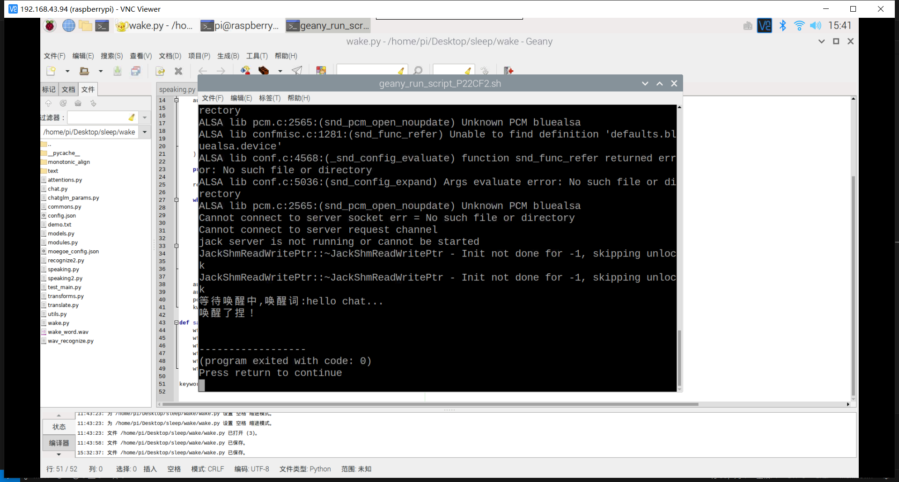

## 前言

承接上一步的语音合成的最后那步的操作。也就是搭建了虚拟环境，成功使用speaking.py合成语音后。

现在目标是再次实现语音唤醒，语音识别，接入chat等等的功能，然后拍下视频。

## 语音唤醒

1. 先找到麦克风和设备号。

arecord -l

    pi@raspberrypi:~ $ arecord -l
    **** List of CAPTURE Hardware Devices ****
    card 2: Device [USB PnP Sound Device], device 0: USB Audio [USB Audio]
    Subdevices: 1/1
    Subdevice #0: subdevice #0

2. 虽然本教程不需要，但也应该检索音频输出的设备和卡号。

aplay -l

    pi@raspberrypi:~ $ aplay -l
    **** List of PLAYBACK Hardware Devices ****
    card 0: b1 [bcm2835 HDMI 1], device 0: bcm2835 HDMI 1 [bcm2835 HDMI 1]
    Subdevices: 4/4
    Subdevice #0: subdevice #0
    Subdevice #1: subdevice #1
    Subdevice #2: subdevice #2
    Subdevice #3: subdevice #3
    card 1: Headphones [bcm2835 Headphones], device 0: bcm2835 Headphones [bcm2835 Headphones]
    Subdevices: 4/4
    Subdevice #0: subdevice #0
    Subdevice #1: subdevice #1
    Subdevice #2: subdevice #2
    Subdevice #3: subdevice #3

3. 手上有了所有的值之后，就可以去修改ALSA配置文件了。在这个文件中，需要输入以下几行。这些行将设置音频驱动程序，并帮助它知道应该与哪些设备进行交互。

nano /home/pi/.asoundrc

    pcm.!default {
    type asym
    capture.pcm "mic"
    playback.pcm "speaker"
    }
    pcm.mic {
    type plug
    slave {
        pcm "hw:2,0"
    }
    }
    pcm.speaker {
    type plug
    slave {
        pcm "hw:1,0"
    }
    }

5. 现在，通过录音来测试麦克风，在你的Raspberry Pi上运行以下命令。

arecord --format=S16_LE --duration=5 --rate=16000 --file-type=raw out.raw

6. 录制完成后，现在可以运行下面的命令来读取原始输出文件，并将其回放给扬声器。

aplay --format=S16_LE --rate=16000 out.raw

7. 如果你发现播放音量或录音音量过高或过低，那么你可以运行以下命令启动混音器。

alsamixer

按住 fn键+F6键，切换声卡，选择你使用的扬声器，我这里是插耳机，也就是Headphones这个，选择以后，滚动滑轮即可调整声音大小。

**配置相应的库**

sudo apt install python3 python3-pip python3-all-dev python3-pyaudio portaudio19-dev libsndfile1（成功）

sudo pip3 install pvporcupine（很慢，要注意安装到了哪里，这个并不是安装在虚拟环境里面的！）

pip3 install PyAudio（第三次成功，因该是源的问题）

## 语音识别

1. 安装环境

pip3 install pvcobra（成功）

百度的语音识别，安装了他的SDK。

安装api所需的库

https://ai.baidu.com/sdk#asr

下载包到树莓派中，然后进入解压好的文件夹，输入

pip3 install .

pip3 install chardet

    开始录音...
    0.018264278769493103 0
    Traceback (most recent call last):
    File "wav_recognize.py", line 123, in <module>
        listen()
    File "wav_recognize.py", line 108, in listen
        filepath = sound_record()
    File "wav_recognize.py", line 46, in sound_record
        pcm = audio_stream.read(porcupine.frame_length)
    File "/home/pi/Desktop/sleep/lib/python3.7/site-packages/pyaudio/__init__.py", line 571, in read
        exception_on_overflow)
    OSError: [Errno -9981] Input overflowed

很眼熟的报错，但我之前没有记录这个错误

## chat

import zhipuai

