https://blog.csdn.net/black_sneak/article/details/131374492
## YOLOv5-Lite

YOLOv5 网络模型算是 YOLO 系列迭代后特别经典的一代网络模型，作者为：Glenn Jocher。部分学者可能认为YOlOv5的创新性不足，其是否称得上 YOLOv5 而议论纷纷。作者认为 YOLOv5 可以算是对 YOLO 系列之前的一次集大成者的总结和突破，其属于非常优秀经典的网络模型框架，各种网络结构和 trick 是非常值得借鉴的！

Yolov5 官方代码中，给出的目标检测网络中一共有4个版本，分别是Yolov5s、Yolov5m、Yolov5l、Yolov5x四个模型。

Yolov5s 网络是 Yolov5 系列中深度最小，特征图的宽度最小的网络。后面的3种都是在此基础上不断加深，不断加宽。Yolov5 的网络结构图如下（源于江大白大佬的结构图）：

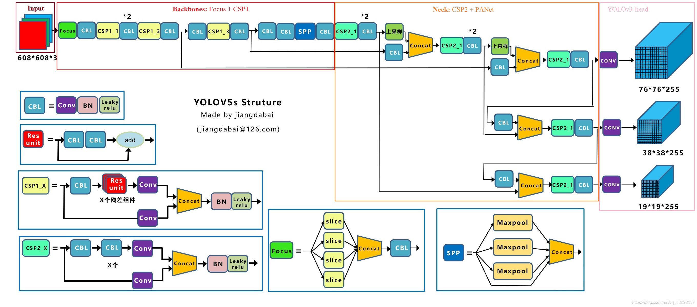

上图即 Yolov5 的网络结构图，可以看出，还是分为输入端、Backbone、Neck、Prediction四个部分。

（1）输入端：Mosaic数据增强、自适应锚框计算、自适应图片缩放
（2）Backbone：Focus结构，CSP结构
（3）Neck：FPN+PAN结构
（4）Prediction：GIOU_Loss
 
Yolov5-Lite 网络模型作为轻量化部署网络的代表作之一，深受算法部署工程师的偏爱（作者为中国ppogg大佬）！

Yolov5-Lite地址：GitHub - ppogg/YOLOv5-Lite: 🍅🍅🍅YOLOv5-Lite: lighter, faster and easier to deploy. Evolved from yolov5 and the size of model is only 930+kb (int8) and 1.7M (fp16). It can reach 10+ FPS on the Raspberry Pi 4B when the input size is 320×320~

Yolov5-Lite 算法的模型结构如图下。该算法去除了 Focus 结构层，减小了模型体量，使模型变得更为轻便；同时，去除了 4 次 slice 操作，减少了对计算机芯片缓存的占用，降低了计算机的处理负担。与 Yolov5 算法相比，Yolov5-Lite 算法能避免反复使用 C3 Layer 模块。C3 Layer 模块会占用计算机很多运行空间，从而降低计算机的处理速度。这种方式能使 Yolov5-Lite 算法模型的精度控制在可靠范围内，从而使其更易部署。

...
...

## YOLOv5-Lite 数据集制作

1. 数据集制作

★常规的神经网络模型训练是需要收集到大量语义丰富的数据集进行训练的。但是考虑实际工程下可能仅需要对已知场地且固定实物进行目标检测追踪等任务，这个时候我们可以采取偷懒的下方作者使用的方法！

1 作者使用树莓派4B的 Camera 直接在捕获需要识别目标物的图片信息（捕获期间转动待识别的目标物体）；

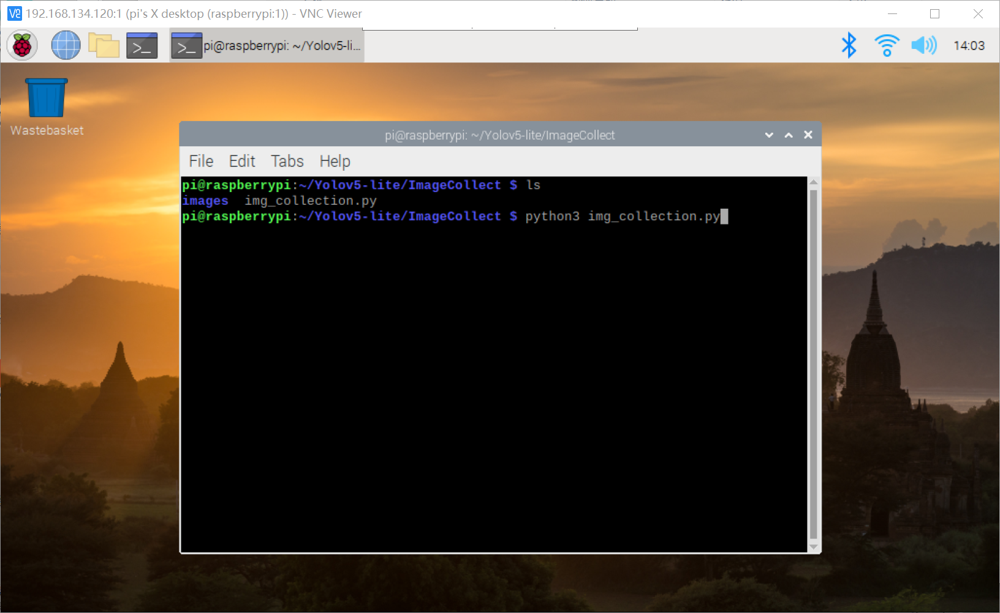

树莓派4B的 Camera 定时捕获照片的python代码如下：

```c
import cv2
from threading import Thread
import uuid
import os
import time
count = 0
def image_collect(cap):
    global count
    while True:
        success, img = cap.read()
        if success:
            file_name = str(uuid.uuid4())+'.jpg'
            cv2.imwrite(os.path.join('images',file_name),img)
            count = count+1
            print("save %d %s"%(count,file_name))
        time.sleep(0.4)
 
if __name__ == "__main__":
    
    os.makedirs("images",exist_ok=True)
    
    # 打开摄像头
    cap = cv2.VideoCapture(0)
 
    m_thread = Thread(target=image_collect, args=([cap]),daemon=True)
    
    while True:
 
        # 读取一帧图像
 
        success, img = cap.read()
 
        if not success:
 
            continue
 
        cv2.imshow("video",img)
 
        key =  cv2.waitKey(1) & 0xFF   
 
        # 按键 "q" 退出
        if key ==  ord('c'):
            m_thread.start()
            continue
        elif key ==  ord('q'):
            break
 
    cap.release() 
		```

按动 “c” 开始采集待识别目标图像，按动 “q” 退出摄像头 Camera 的图片采集；

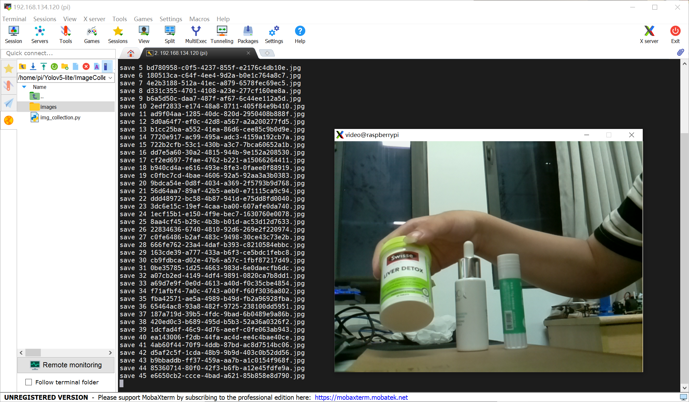

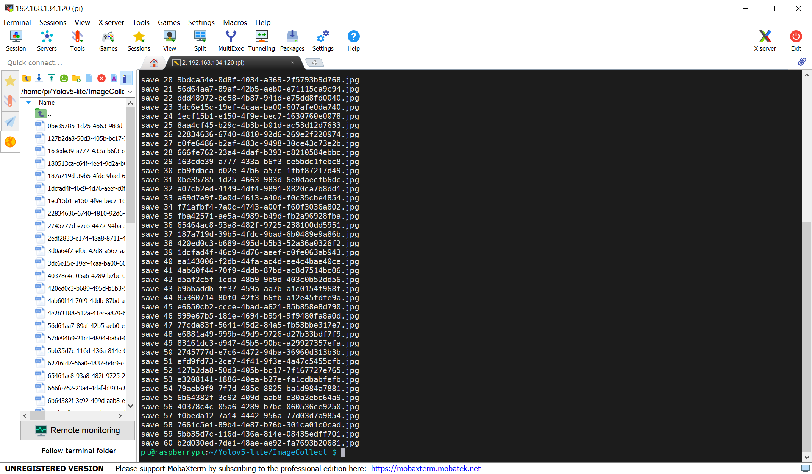

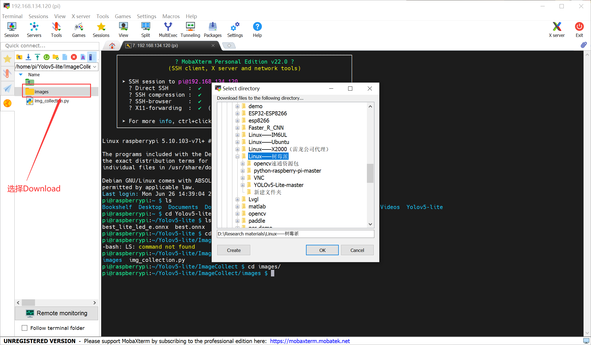

2 将捕获到的待识别目标物照片传输到PC端，利用 Labelme 软件进行标注（Labelme不会使用的建议相关博客）；

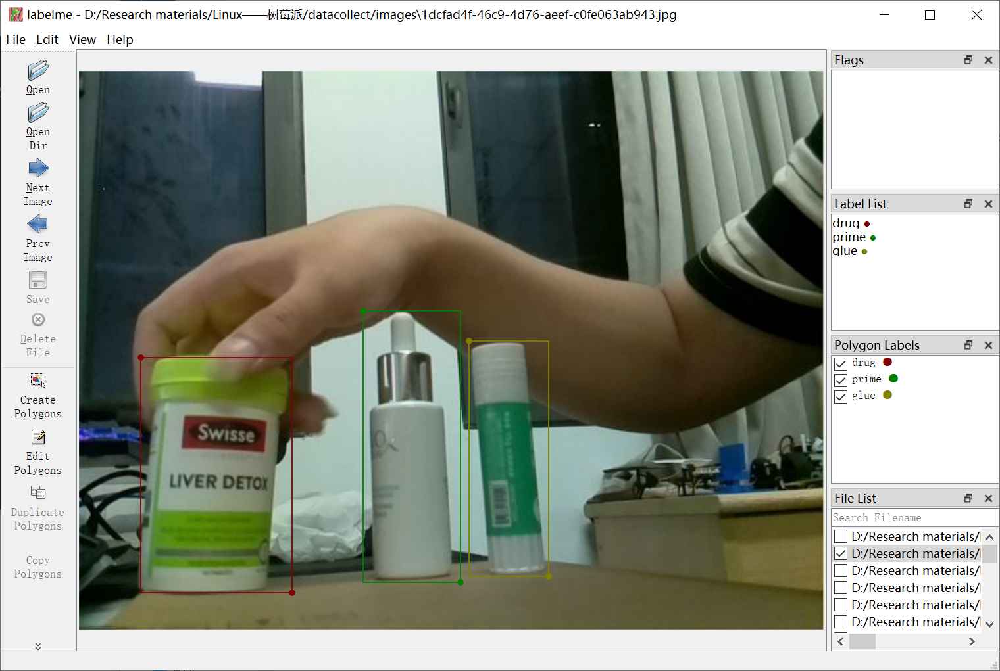

作者的标注了 3 类目标：drug，prime，glue；读者朋友可以根据自己实际情况标注自己需要的数据集！由于我们标注的数据的标签 label 默认是 JSON 格式的不能被 YOLO 系列的神经网络模型直接进行利用训练。

3 使用 JSON 转 txt 的 YOLO 格式 label 的python代码进行转换（可以直接使用作者提供的代码）：

dic_lab.py：

```c
dic_labels= {'drug':0,
            'glue':1,
            'prime':2,
             'path_json':'labels',
             'ratio':0.9}
```
lablemetoyolo.py：
```c
import os
import json
import random
import base64
import shutil
import argparse
from pathlib import Path
from glob import glob
from dic_lab import dic_labels
 
def generate_labels(dic_labs):
    path_input_json = dic_labels['path_json']
    ratio = dic_labs['ratio']
    for index, labelme_annotation_path in enumerate(glob(f'{path_input_json}/*.json')):
 
        # 读取文件名
        image_id = os.path.basename(labelme_annotation_path).rstrip('.json')
        
        # 计算是train 还是 valid
        train_or_valid = 'train' if random.random() < ratio else 'valid'
 
        # 读取labelme格式的json文件
        labelme_annotation_file = open(labelme_annotation_path, 'r')
        labelme_annotation = json.load(labelme_annotation_file)
 
        # yolo 格式的 lables
        yolo_annotation_path = os.path.join(train_or_valid, 'labels',image_id + '.txt')
        yolo_annotation_file = open(yolo_annotation_path, 'w')
        
        # yolo 格式的图像保存
        yolo_image = base64.decodebytes(labelme_annotation['imageData'].encode())
        yolo_image_path = os.path.join(train_or_valid, 'images', image_id + '.jpg')
        
        yolo_image_file = open(yolo_image_path, 'wb')
        yolo_image_file.write(yolo_image)
        yolo_image_file.close()
     
 
        # 获取位置信息
        for shape in labelme_annotation['shapes']:
            if shape['shape_type'] != 'rectangle':
                print(
                    f'Invalid type `{shape["shape_type"]}` in annotation `annotation_path`')
                continue
           
 
            points = shape['points']
            scale_width = 1.0 / labelme_annotation['imageWidth']
            scale_height = 1.0 / labelme_annotation['imageHeight']
            width = (points[1][0] - points[0][0]) * scale_width
            height = (points[1][1] - points[0][1]) * scale_height
            x = ((points[1][0] + points[0][0]) / 2) * scale_width
            y = ((points[1][1] + points[0][1]) / 2) * scale_height
            object_class = dic_labels[shape['label']]
            yolo_annotation_file.write(f'{object_class} {x} {y} {width} {height}\n')
        yolo_annotation_file.close()
        print("creat lab %d : %s"%(index,image_id))
 
 
if __name__ == "__main__":
    os.makedirs(os.path.join("train",'images'),exist_ok=True)
    os.makedirs(os.path.join("train",'labels'),exist_ok=True)
    os.makedirs(os.path.join("valid",'images'),exist_ok=True)
    os.makedirs(os.path.join("valid",'labels'),exist_ok=True)
    generate_labels(dic_labels)
 
```

我们需要根据自己的需要自定义字典 dic_lab，字典中的 ratio = 0.9 的作用是将数据集拆分成训练集和验证集 9：1。读者朋友可以根据自己的实际情况去修改字典的标签内容，成功执行 lablemetoyolo.py 代码后效果如下：


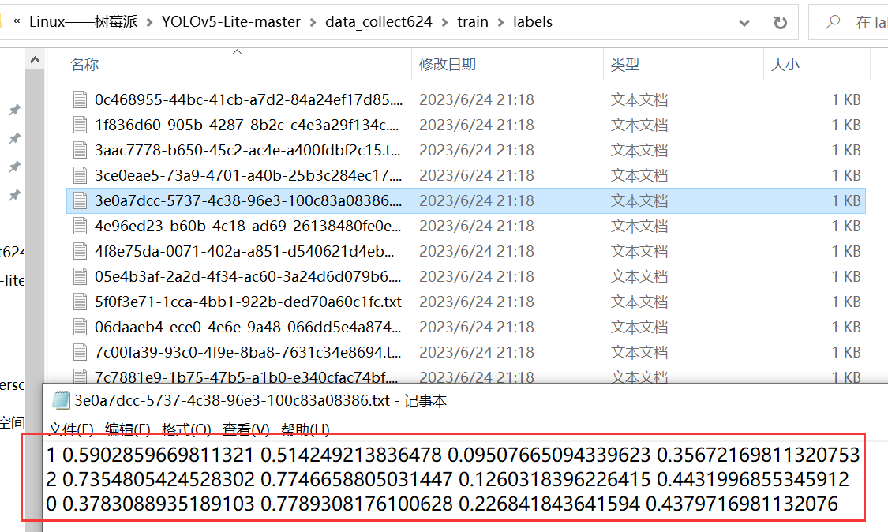

labels文件夹下的标签成功转换了 YOLO 系列可以使用的 label 标签，到此时就已经成功准备好我们需要的训练集了！

特别说明：该方法仅适用于上述作者所说的场景下，实际情况下，建议大家还是使用合格的数据集进行训练（即目标与背景语义丰富的数据集），使得训练出来的神经网络具有良好的泛化性与鲁棒性，否则训练出来的网络很容易过拟合！


## 实验过程

1. 前置步骤
开了张新卡，烧录镜像、配置vnc、配置源、


    打开vnc：sudo raspi-config

    选择resolution分辨率，sudo raspi-config...略（搜索使用VNC连接树莓派4b如何全屏1080p分辨率，一次更改永久有效！）

    配置源
    sudo nano /etc/apt/sources.list

    deb http://mirrors.tuna.tsinghua.edu.cn/raspbian/raspbian/ buster main non-free contrib rpi

    deb-src http://mirrors.tuna.tsinghua.edu.cn/raspbian/raspbian/ buster main non-free contrib rpi

    sudo nano /etc/apt/sources.list.d/raspi.list
    同样的方法，把 /etc/apt/sources.list.d/raspi.list 文件也替换成下面的内容：

    deb http://mirrors.tuna.tsinghua.edu.cn/raspberrypi/ buster main ui

    sudo apt-get update

    问题：1.为了让这个仓库能够应用，这必须在更新之前显式接受。更多细节请参阅 apt-secure(8) 手册。

    解决方案：sudo apt update,然后按Y

    配置pip源

    sudo nano /etc/pip.conf 

    [global]
    timeout=100
    index-url=https://pypi.tuna.tsinghua.edu.cn/simple/
    extra-index-url= http://mirrors.aliyun.com/pypi/simple/
    [install]
    trusted-host=
            pypi.tuna.tsinghua.edu.cn
            mirrors.aliyun.com

    python -m pip install --upgrade pip
    python3 -m pip install --upgrade pip

配置geany

    geany上部工具栏中点击：生成->设置生成命令(s)
    

    接下来需要修改"Python命令"下的Compile和执行命令下的Execute。
    Compile->

    python3的路径/python3 -m py_compile “%f”

    Execute

    python3的路径/python3 “%f”

树莓派里面用Geany打开文件夹可以在工具里的插入管理器哪里选择文件插件，就可以打开文件夹了


安装库很慢，卡主的原因可能是因为swap空间不住

    free -m 查看swap空间大小（96左右）

    sudo apt-get install dphys-swapfile 

    sudo nano /etc/dphys-swapfile

    CONF_SWAPSIZE=4096 （找到这个地方，修改）

    sudo /etc/init.d/dphys-swapfile restart


    重启

    free -m 查看，变为了4095

2. 安装库

sudo apt update
sudo apt install python3-opencv

使用代码拍摄了100张左右的图片，传到电脑上，使用下载的labelme.exe标记。

标记的时候要注意标记的是矩形，而非其他形状，否则就会白费功夫，我就标了快一个多小时，然后运行代码报错的时候才发现。后面才发现似乎有一个autolabeling的东西。靠。所以一定要看看官方文档！！

工作是做不完的、唯有提升效率才是真的。做到一半、面对问题卡住了，怎么办。就像是现在，按着教程做，但是遇到了问题，将报错丢给gpt，说。

    这个错误表明在处理数据集时出了问题，具体地说是在加载标签时出现了错误。根据错误信息，似乎是在尝试从缓存中读取标签时出现了问题。可能的原因包括：

    标签文件缺失或格式不正确： 确保数据集中的标签文件存在且格式正确。标签文件应该包含与图像相关联的对象的位置和类别信息。

    数据集路径错误： 确保指定的数据集路径正确，能够找到图像和相应的标签文件。

    缓存文件损坏： 缓存文件可能损坏了，可以尝试删除缓存文件并重新运行以重新生成缓存。

    数据集中的图像文件损坏： 可能有一些图像文件损坏或格式不正确，导致无法读取图像和相应的标签。

    数据集标签不匹配： 确保标签文件中的每个图像都有对应的标签，且标签格式与代码期望的格式匹配。

分析：1.数据集有问题（标签、路径、图片）2.缓存有问题

-----

自己的数据集一直不行，试着先拿范例的数据集先训练一次模型先

在github下载YOLOv5-Lite-master，获取https://gitee.com/yuhong-ldu/python-raspberry-pi/tree/master/EXP-yolov5-lite里的资料，按照https://www.bilibili.com/video/BV14r4y1578r/?spm_id_from=333.788&vd_source=1b3a69827a34547eb2ee0ed4099455e7说的做。

过程中遇到很多bug：
1. 个是要将np.int改为int，因为包更新了，之前的弃用了 
2. loss.py文件运算错误RuntimeError: result type Float can’t be cast to the desired output type long int · Issue#35 · WongKinYiu/yolov7 · GitHub，参考https://blog.csdn.net/weixin_41012399/article/details/127765978
3. not enough values to unpack (expected 3, got 2) 解决：将test.py的110行改为out, train_out = model(img, augment=augment)  # inference and training outputs

接着就可以顺利训练了，


两百来张数据集，没有gpu的话大概5、6个小时，差不多一个晚上的时间，用gpu的话这个工作量大概十来分钟，电脑有gpu，搞过一次，没成功，现在尝试着弄一下

总结：问题不难，找到渠道就简单了，我花了很多的时间纠结在数据集上面，但某个教学视频的评论区里面就有着老师的数据集，这才解决了数据集的麻烦，我才确认了数据集的格式，后面有报错，绝大多数的bug都可以在评论区里找到，或者是网上搜到，找gpt解决，这得出一个结论，找的方法渠道，要找最宽广的那一条，那样可以参考借鉴的就多，就像是这次查找的资料，找了一个热门的，结果很多别遇到过的bug都在评论区里。找对方法很重要。

## gpu加速 

查阅电脑显卡版本
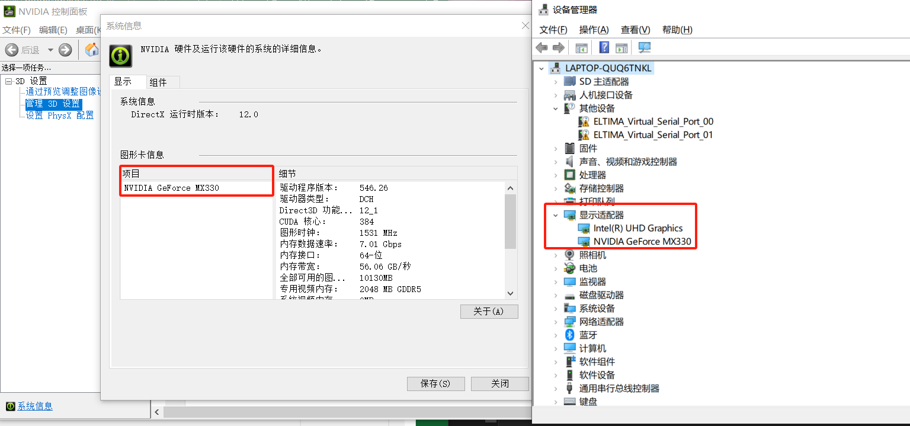

电脑显卡版本：NVIDIA GeForce MX330

卸载NVDIA的相关程序
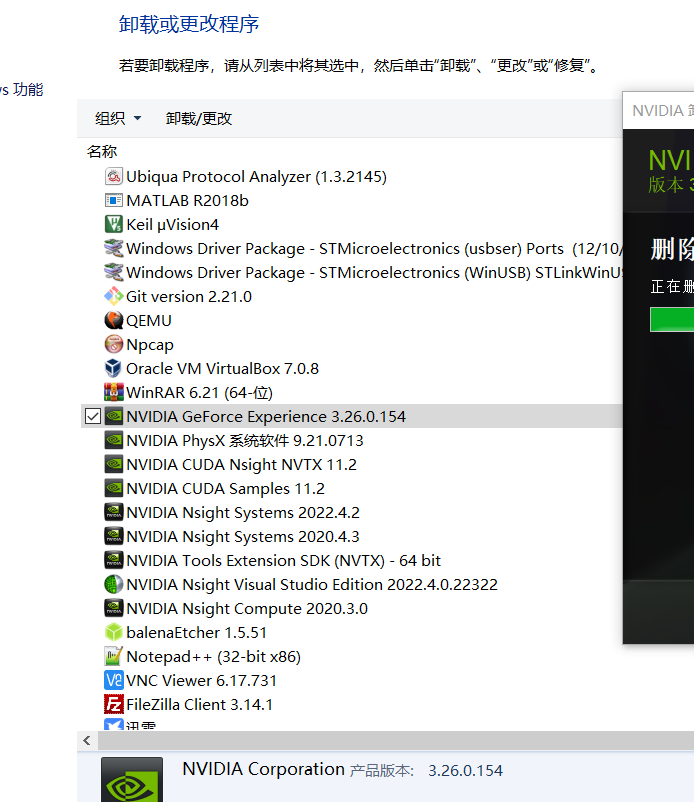

**学习计划**
在一小时内基本学习 GPU 和 CUDA，我建议你可以按照以下步骤来进行：

**步骤一：了解 GPU 和 CUDA 的基础知识（20 分钟）**

首先了解什么是 GPU，以及它如何用于加速并行计算。
然后了解什么是 CUDA，以及它如何在 NVIDIA 的 GPU 上进行编程。
你可以阅读 NVIDIA 官方网站或者相关教材中的简介部分，或者观看一些在线教程或视频。

**步骤二：设置 CUDA 环境（10 分钟）**

确认你的机器是否有 NVIDIA 的 GPU，并且是否支持 CUDA。
安装 NVIDIA 的驱动程序和 CUDA 工具包。

**步骤三：编写并运行你的第一个 CUDA 程序（20 分钟）**

学习 CUDA 编程的基本概念，包括线程、块、网格和内存模型。
编写一个简单的 CUDA 程序，例如使用 GPU 进行向量加法。
你可以找一些 CUDA 的教程或样例代码，然后自己动手实践。

**步骤四：理解并优化 CUDA 程序（10 分钟）**

学习如何使用 CUDA 的内存管理功能，包括全局内存、共享内存和常量内存。
学习如何优化 CUDA 程序，包括线程并行度、内存访问模式和指令级并行。
以上就是一小时内学习 GPU 和 CUDA 的一个可能的学习计划。这只是一个初级的介绍，要熟练掌握 GPU 和 CUDA 编程，还需要更深入的学习和实践。如果在学习过程中遇到任何问题，你可以查阅 CUDA 的官方文档，或者在网上寻找相关的教程和问答。

步骤三和步骤四主要涉及到 CUDA C/C++ 编程，这不需要任何额外的库或技术，只需要 NVIDIA 提供的 CUDA Toolkit。

了解 GPU 和 CUDA 的基础知识

什么是 GPU，以及它如何用于加速并行计算

什么是 GPU？

GPU （Graphics Processing Unit，图形处理单元）最初是为了加速计算机图形渲染而设计的。与中央处理单元（CPU）不同，CPU 是为了处理一系列的任务而设计的，而 GPU 是为了并行处理大量的数据而设计的。这种并行性使 GPU 特别适合处理那些可以分解为多个小任务并且可以同时执行的问题，例如图形渲染。

GPU 的特点：

    大量的核心 ：传统的 CPU 可能有 4、8、16 或更多的核心，而 GPU 可能有上千个核心。这些核心可以同时处理大量的任务。
    高吞吐量 ：尽管每个单独的 GPU 核心的速度可能比 CPU 核心慢，但由于其数量众多，GPU 可以处理的总任务数量远远超过 CPU。
    专为并行处理设计 ：GPU 的设计原则是大量并行处理。每个核心都是为了处理独立的、相对简单的任务而设计的。
    内存体系结构 ：GPU 通常有自己的专用内存，这使得数据的读取和写入非常快。但这也意味着数据需要在主机（CPU）和设备（GPU）之间进行传输。

GPU 如何用于加速并行计算？

随着 GPU 的发展，人们逐渐意识到除了图形渲染之外，它们还可以用于其他类型的并行计算任务。以下是 GPU 用于并行计算的一些方式：

    通用 GPU 计算 ：人们开发了一系列工具和技术，如 NVIDIA 的 CUDA 和 OpenCL，允许开发人员直接为 GPU 编写代码，以执行非图形相关的计算任务。
    大数据处理 ：由于其并行性，GPU 非常适合处理大数据集。例如，在数据科学、金融建模和物理模拟中，可以使用 GPU 加速数据处理和分析。
    深度学习和人工智能 ：近年来，GPU 已经成为深度学习和 AI 研究的关键工具。神经网络的训练涉及大量的矩阵运算，这些运算可以在 GPU 上并行执行，从而大大减少训练时间。
    分子建模和仿真 ：GPU 可以用于并行处理与药物设计、气候模型和其他科学应用相关的复杂计算。
    图形和视频处理 ：除了传统的3D图形渲染，GPU 也被用于视频编解码、图像分析和其他多媒体任务。

总结：

GPU 由于其高度并行的结构和设计，已经从一个专门用于图形渲染的设备发展成为一个通用的、高性能的计算工具。从科学研究到商业分析，从游戏到艺术创作，GPU 在许多领域都发挥着关键作用，加速了各种各样的并行计算任务。

了解什么是 CUDA，以及它如何在 NVIDIA 的 GPU 上进行编程

CUDA（Compute Unified Device Architecture）是NVIDIA公司开发的一个并行计算平台和编程模型。它允许开发者直接使用NVIDIA的GPU来执行通用计算任务，从而获得比传统CPU计算更高的性能。CUDA基本上是将GPU从一个纯粹的图形渲染设备转变为一个通用并行处理器。

CUDA的主要特点：

    并行处理 ：NVIDIA的GPU由数千个处理核心组成，可以并行处理大量的任务。
    适用于高度并行的计算任务 ：如图形渲染、科学计算、深度学习等。
    与C/C++语言集成 ：CUDA提供了一个C语言的扩展，使得开发者可以在C/C++代码中直接编写运行在GPU上的函数（称为kernels）。

CUDA编程的基本概念：

    Kernel ：在GPU上运行的函数，可以并行处理多个数据元素。
    Thread：执行kernel的基本单位。每个线程都会处理数据的一个或多个元素。
    Block ：线程的集合。一个block内的所有线程都可以共享一定的内存资源。
    Grid ：block的集合。整个grid是在GPU上并行执行kernel的所有线程的集合。

CUDA编程的基本步骤：

    数据分配 ：在主机（CPU）和设备（GPU）之间分配和初始化内存。
    数据传输 ：将数据从主机传输到设备。
    Kernel启动 ：指定grid和block的大小，并在GPU上启动kernel。
    数据检索 ：将结果从设备传输回主机。
    清理 ：释放设备和主机上的内存资源。

设置 CUDA 环境

确认机器是否有NVIDIA的GPU的方法

1. 使用NVIDIA系统管理工具 (nvidia-smi)

如果您的系统上已经安装了NVIDIA的驱动程序，那么您可能已经有了 nvidia-smi这个工具。这是一个命令行工具，可以显示有关NVIDIA GPU的详细信息。

在命令行或终端中运行以下命令：

nvidia-smi
运行结果
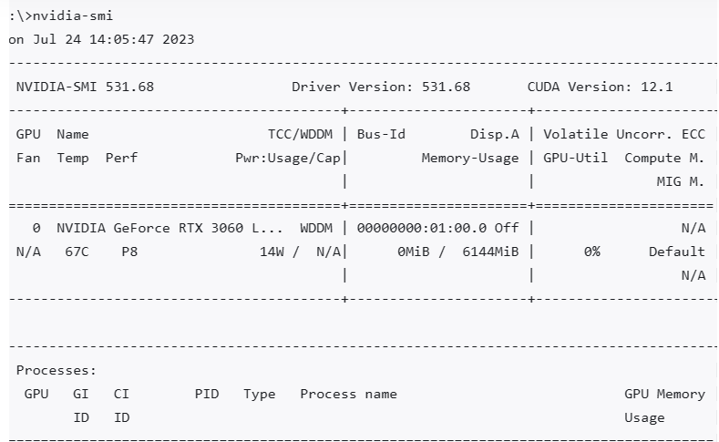

在nvidia-smi的输出中，以下部分给出了关于NVIDIA软件和驱动的版本信息：

    NVIDIA-SMI 531.68：这表示你正在使用的NVIDIA System Management Interface (SMI)工具的版本号。SMI工具用于查询和控制NVIDIA GPU的状态和配置。
    Driver Version: 531.68：这表示你的系统上安装的NVIDIA GPU驱动程序的版本号。这个数字通常与NVIDIA-SMI的版本匹配，因为它们都是驱动程序套件的一部分。
    CUDA Version: 12.1：这表示与你的驱动程序兼容的CUDA版本。CUDA是NVIDIA的并行计算平台和应用程序接口，允许开发者使用NVIDIA GPU进行通用计算。需要注意的是，这表示驱动程序支持的CUDA版本，但不一定是你系统上实际安装的CUDA工具包版本。

总的来说，这些版本信息对于确保软件和硬件的兼容性、进行故障排除、以及确定是否需要软件或驱动程序更新都很重要。

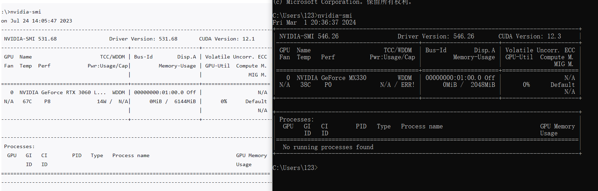

2. 查看设备管理器 (仅限Windows)

打开"设备管理器"（可以在开始菜单中搜索"设备管理器"）。
在"设备管理器"窗口中，展开"显示适配器"部分。
在那里，您应该能够看到所有的显卡，包括NVIDIA GPU（如果有的话）。

判断NVIDIA的GPU是否支持CUDA

使用 nvidia-smi

如果你已经安装了NVIDIA驱动，你可以使用 nvidia-smi命令来查看GPU的详细信息。在命令行或终端中运行：

nvidia-smi
这将显示一个关于你的NVIDIA GPU的详细报告。如果你的GPU支持CUDA，它会在输出中列出，并显示CUDA版本。

从您给出的 nvidia-smi输出中，我们可以得到以下关于CUDA的信息：

是否支持CUDA ：由于您的输出中显示了"CUDA Version: 12.1"，这意味着您的NVIDIA GPU确实支持CUDA。

CUDA的版本 ：

    驱动支持的CUDA最大版本 ：在输出中的"CUDA Version: 12.1"表示您的NVIDIA驱动程序支持的CUDA最大版本是12.1。这不是您实际安装的CUDA工具包版本，而是驱动程序兼容的最高版本。
    正在使用的CUDA版本 ：要查找实际安装的CUDA工具包版本，您需要检查CUDA安装目录（比如：C:\Program Files\NVIDIA GPU Computing Toolkit\CUDA\v11.7）或使用特定的CUDA API/functions。在您的 nvidia-smi输出中，"Driver Version: 531.68"只是告诉我们您的NVIDIA驱动程序版本，而不是您正在使用的CUDA版本。

GPU型号 ：您的GPU是NVIDIA GeForce RTX 3060 Laptop GPU。这是一款支持CUDA的现代GPU。

总之，从您的 nvidia-smi输出中，我们可以确认您的GPU支持CUDA，并且您的驱动程序支持的最大CUDA版本是12.1。但要确定您实际安装并正在使用的CUDA版本，您需要查看CUDA的安装目录或使用其他方法。

2. 查看NVIDIA的官方支持列表

NVIDIA在其官方网站上有一个CUDA GPUs的支持列表。你可以访问这个列表来查看你的GPU型号是否被列出。如果它在列表上，那么它肯定支持CUDA。

以下是一个直接链接到NVIDIA CUDA GPUs的支持列表的链接（请注意，随着时间的推移，链接可能会发生变化，因为NVIDIA可能会更新其网站结构）：

https://link.zhihu.com/?target=https%3A//developer.nvidia.com/cuda-gpus

点击链接将带您到一个页面，列出了各种NVIDIA GPU和它们支持的CUDA计算能力。您可以在此列表中查找您的GPU型号，以确定它是否支持CUDA。

------------------------------------

安装NVDIA驱动，我的显卡是MX330，找不到对应的驱动程序，在：https://driverpack.io/zh-cn/devices/video/nvidia/nvidia-geforce-mx330?os=windows-10-x64 这里自动安装了对应的。真不知道之前是怎么安装的。

按正常方法，我的这个显卡在官方那边显示，是不具备安装cuda的。但我还是像试一试

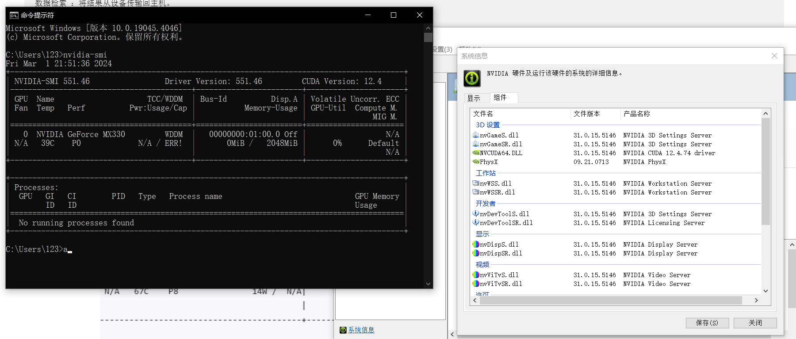

安装的cuda版本最高支持为12.4.74

网上直接下载最新版cuda12.3以及cudnn9.0.0，然后安装（似乎不需要陪环境变量，是自动的），注意如图的那个不要安装，。
两个都安装完后，测试，

nvcc -V
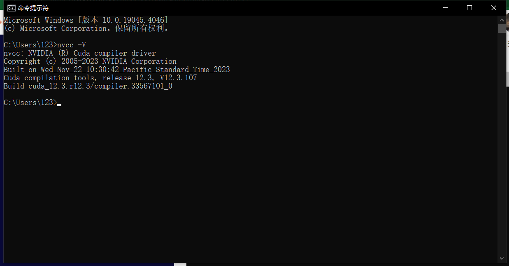

切换到C:\Program Files\NVIDIA GPU Computing Toolkit\CUDA\v1.3\extras\demo_suite目录下，命令行执行bandwidthTest.exe，查看结果是否如下图，显示Pass则安装成功。
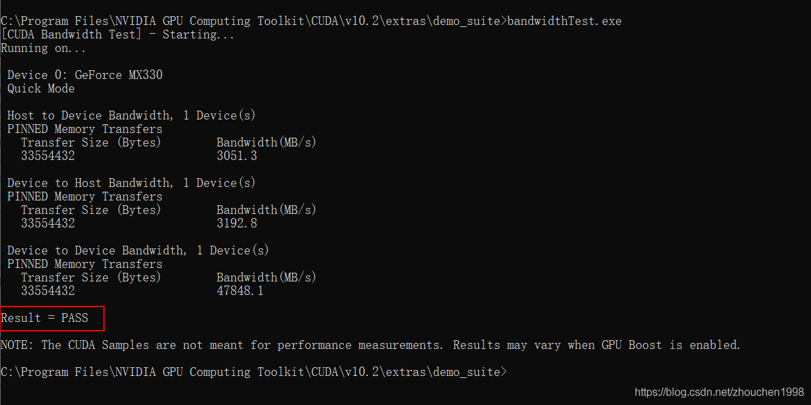

cuda和cudnna安装成功，接下来就是在python安装对于的环境了，但今晚先用着cpu跑着先，明天早上看看怎么样。明天弄一下pycharm的gpu环境，看看能不能跑gpu。

## 实验过程2

前言：模型训练出来了，gpu加速暂时不想搞了。重新明确了一下目标，当搞到训练大一点的模型的时候，在试着学习一下搞gpu加速，以及学习一下白嫖谷歌的额度。

    目标：训练模型，使其能够分辨三个状态，睡眠、玩手机、看书学习。
    实现需要的能力：
    1.学会训练和部署最简单的模型
    2.学会训练一个合适的模型

    实现过程：
    1.训练范例的模型（完成）
    2.部署范例的模型
    3.训练自己的模型
    4.部署自己的模型
    5.训练大一点的模型
    6.部署大一点的模型

**将模型导出生成onnx模型**

python export.py --weights best.pt

报错：AttributeError: 'Namespace' object has no attribute 'ncnn'

    解决方案：
    1.（成功）如果你确实需要使用ncnn参数，你应该在argparse.ArgumentParser()的定义中添加这个参数，如下所示：
    parser.add_argument('--ncnn', action='store_true', help='ncnn or not')
    这样就可以在命令行中使用--ncnn开关，并且opt.ncnn会根据命令行是否使用了这个开关而相应地设置为True或False。

    2.如果ncnn参数并不需要，你可以从条件语句中移除对opt.ncnn的引用，即删除或注释掉涉及opt.ncnn的那部分代码。如果这个参数不是脚本所必需的，这样做可以避免出现上述错误。

    3.确保所有涉及的参数都已经定义。如果脚本中的其他部分需要ncnn参数，确保它已经在脚本开始处通过argparse正确添加。

成功将best.pt转换为best.onnx后，使用 onnx-simplifier 对转换后的 onnx 进行简化：

pip install -U onnx-simplifier --user
python -m onnxsim best.onnx e.onnx


树莓派部署lite模型

配置环境：（略）

    mkdir my_project
    cd my_project
    python3 -m venv venv
    source venv/bin/activate
    pip install ....
    deactivate

1.安装onnxruntime
wget -O onnxruntime-1.9.1-cp37-none-linux_armv7l.whl https://github.com/PINTO0309/onnxruntime4raspberrypi/releases/download/v1.9.1/onnxruntime-1.9.1-cp37-none-linux_armv7l.whl_np1195

pip3 install onnxruntime-1.9.1-cp37-none-linux_armv7l.whl


2.安装cv2
pip3 install --upgrade opencv-python（报错）
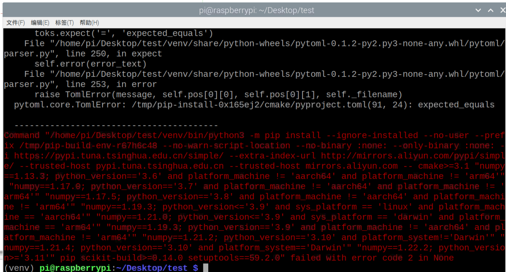

看来没那么容易了

    尝试（失败、还是报那个错误）：https://www.bilibili.com/video/BV1G3411e7Gx/?spm_id_from=333.788&vd_source=1b3a69827a34547eb2ee0ed4099455e7
    安装依赖包
    sudo apt-get install -y libopencv-dev python3-opencv
    sudo apt-get install libatlas-base-dev
    sudo apt-get install libjasper-dev 
    sudo apt-get install libqtgui4 
    sudo apt-get install python3-pyqt5 
    sudo apt install libqt4-test

    安装Python 包（ps：opencv4.5.5需要numpy1.18以上）
    pip3 install opencv-python

gpt分析说因为某种原因而停止，但报错没有具体说明是什么原因。

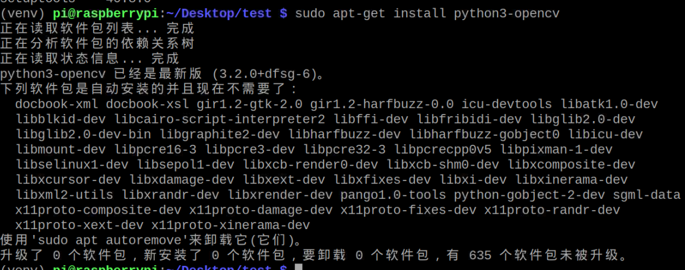

在geany中设置环境

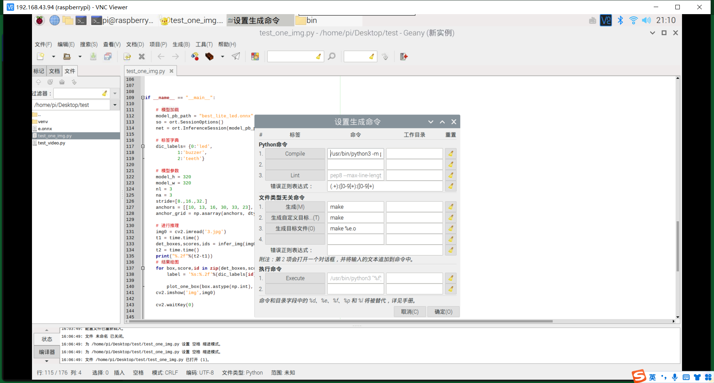

跑代码运行时报错，发现onnxruntime能用，但cv2不能用，原因是cv2安装在系统级环境里了，而onnxruntime安装在虚拟环境里，此刻我正在用的编译是虚拟环境的。

再次尝试（https://zhuanlan.zhihu.com/p/634653426）

安装依赖（已安装，掠过）

    确定架构
    (venv) pi@raspberrypi:~/Desktop/test $ uname -a
    Linux raspberrypi 5.10.63-v7l+ #1457 SMP Tue Sep 28 11:26:14 BST 2021 armv7l GNU/Linux

系统用的是 armv7l 架构

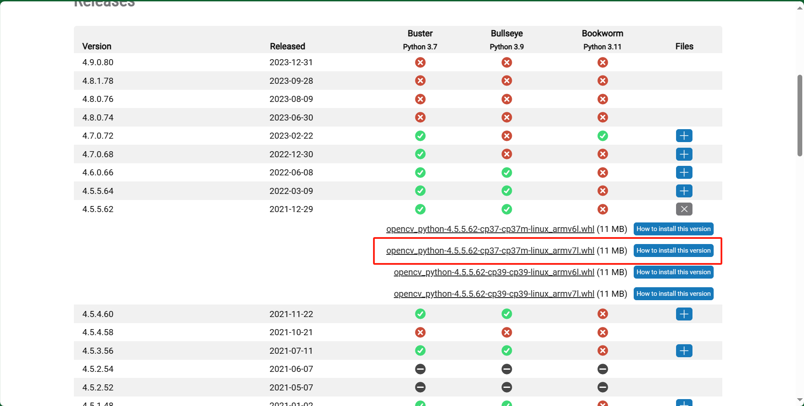
安装这个opencv_python-4.5.5.62-cp37-cp37m-linux_armv7l.whl （成功）

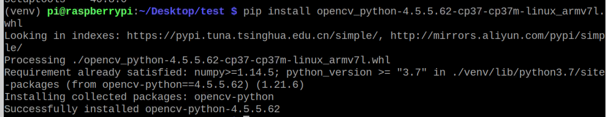

部署成功

跑代码的时候，使用老师的模型可以，但使用自己训练的不行。报错：ValueError: operands could not be broadcast together with shapes (3,2,40,8) (4800,2) 

经研读评论区，发现很多人都遇到过这个问题，说是onnx转化的时候出现的问题，可能是代码的问题，于是根据建议去github使用其他人的export.py进行onnx模型转化，最终成功

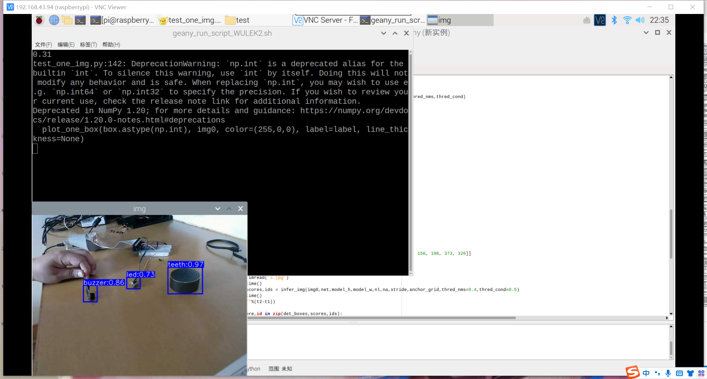

总结：
1.查阅的资料要注意辨别，过去常常犯了一个错误，就是没有分辨资料是否过时，使用尝试的资料常常各个时间段不一，最好使用google搜索，特别是搜寻最近一年的那种比较新的资料。

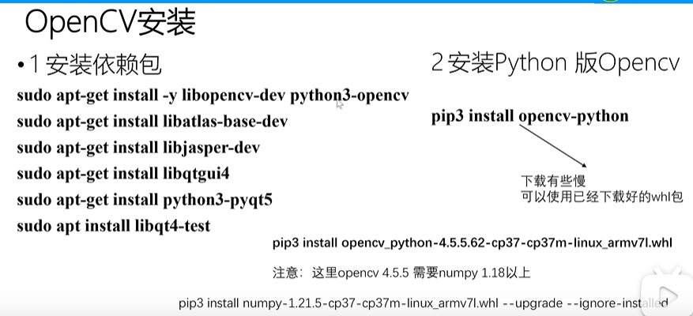

2.答案近在咫尺，就是手动将轮子下载，然后安装即可，但我偏偏相信了pip3 install opencv-python，我以为这两个方法是等同的，pip install opencv-python失败，我以为那么手动安装轮子自然也就会失败，我想应该是pip install opencv-python安装的应该是linux通用系统的版本，安装的话可能要手动指定，类似于pip install opencv_python-4.5.5.62-cp37-cp37m-linux_armv7l...这类的吧，符合python版本，符合系统架构、与numpy对应。
我记得pip是一个帮助包自动安装的辅助工具，过去我太信任他了，忽略了它可能安装错误版本的可能，以为它会自动的帮我根据系统分辨出要安装的版本，结果到最后还是要自己手动的选择。pip能帮忙偷一部分的懒。

3.寻找讲课老师的仓库还是很有用的，有时他会将一些包整理的他的gitee上。遇到错误，去github上寻找现成的也比较好，特别是现成的代码，正确的代码。若是能够注意一下，能省去很多是时间。

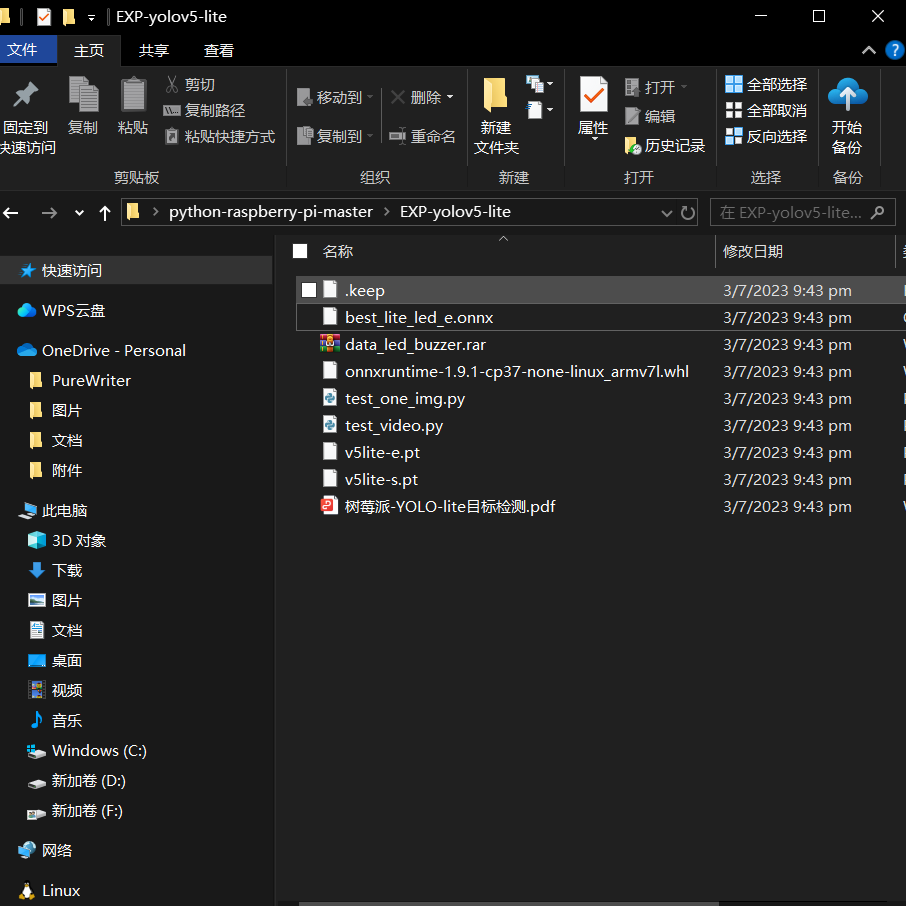

现在尝试训练用自己的数据，训练自己的模型、部署自己的模型

我再评论区里注意到了一个评论，说的是用labelme标记自己的数据集，然后转化为yolo格式，却出现了负数。后面他又回答了，换个软件就可以了。我看自己的数据集，确实也出现了负数，而且在训练的时候，发现数据集不正确。

或许我应该要学习一下标记数据集了，可能是软件的问题，也可能是转化的时候出现了问题。

过程检查：
1.labelme标记是否规范，得出的json文件能不能用
2.将json文件转化为yolo格式的过程是否规范，得出的文件能不能用

标注数据的正确性：可以用labelme打开json文件检查（可以打开，似乎没有问题）
验证 JSON 文件的格式：JSON 文件应该遵循正确的 JSON 格式。你可以使用在线 JSON 验证工具，例如 JSONLint，来验证文件是否有效。（验证为有效）

或许是2出现了问题。
换成了老师的代码转化，还是如此，应该不是2的问题。

可能是label软件的问题，当初怕麻烦，没有弄那种需要python环境的，下了个双击就运行的那种，结果如此，不知道是不是因怕麻烦而遇到更多的麻烦，现在弄回当初需要python环境的那个，看看是不是如此。
https://blog.csdn.net/weixin_46502301/article/details/115829811

安装成功，过程中遇到了一些问题，如

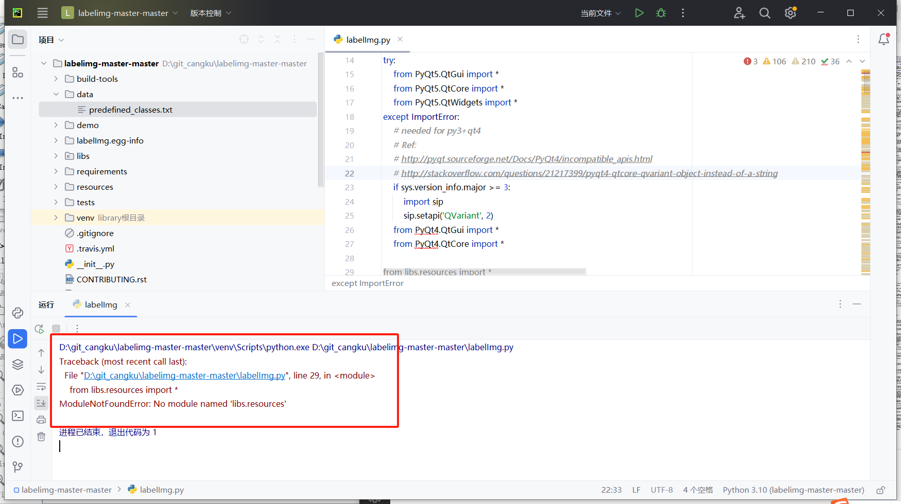

这问题没有解决，我是从github给的资料弄好的，通过虚拟环境那一个，make qt5py3不行，好像没有make这个东西，于是打开了makefile文件手动执行，pyrcc4 -o line/resources.py resources.qrc，然后按步骤来，成功，后面发现这和下面那个方法很像。

运行老是崩溃，重新规范搞一次，还是崩溃，应该要改代码


成功

可以开始标记了，但拍摄的图片不太好，重新拍过

标注的时候要吧其他无关的标签删去，否则还是会训练失败。

训练成功，部署成功，拍了6张图片识别，成功了一大半，其中有一个识别错了，把手机识别成了书本，有两张没有识别出来书本，或许是因为手有遮挡的缘故，也就是数据集不够好。

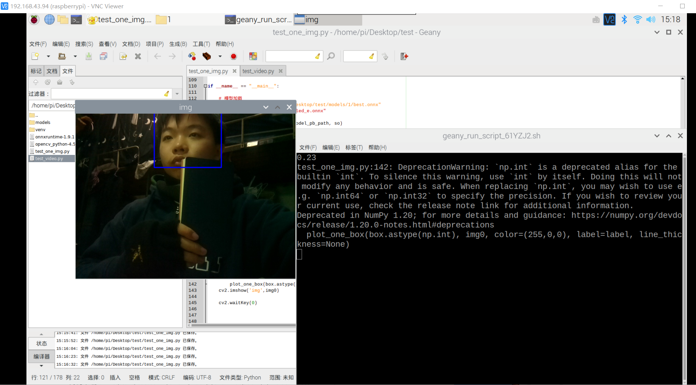

视频也可以识别，但书和手机似乎很混淆，不太行的样子。

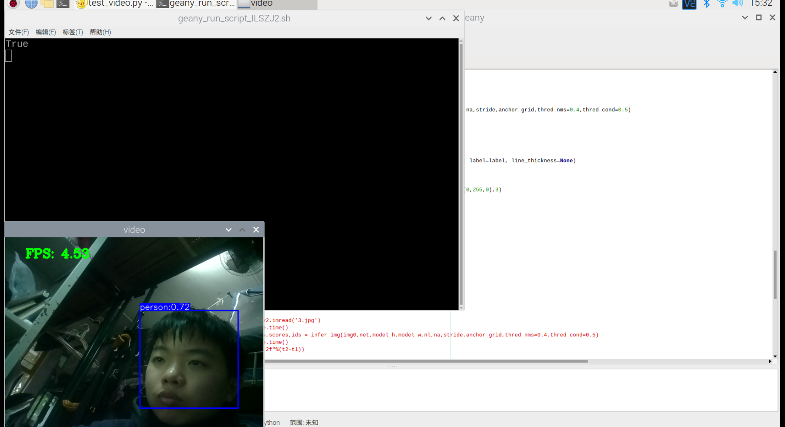

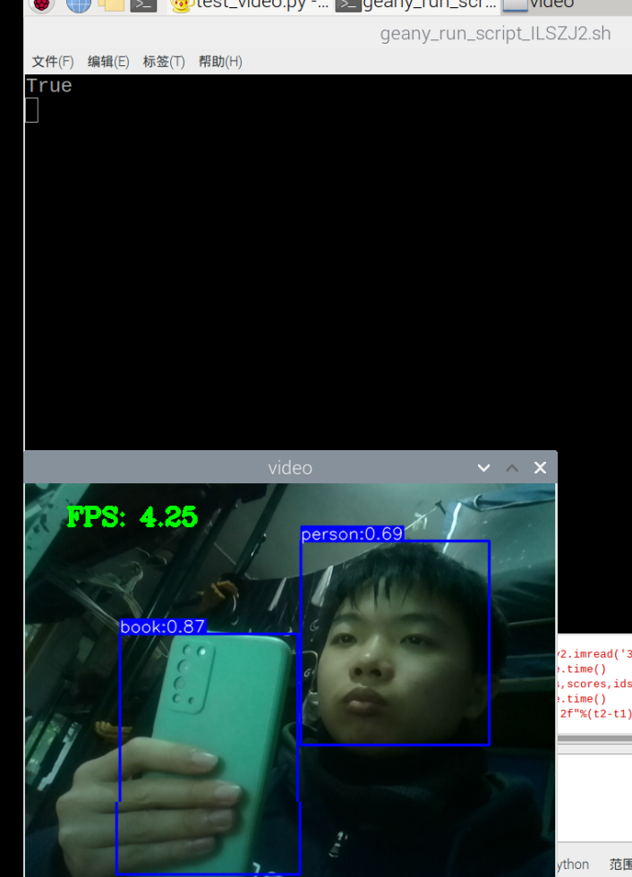

## gpu加速2

接下来准备训练大一点的，更好更精确的模型，然后把它部署。首先要面对几个问题：
1.能不能gpu加速
2.能不能弄到合适的数据集

若可以gpu加速的话，那就看你不需要白嫖谷歌的额度了，用自己的电脑训练，若是不能，就只能用一下谷歌的那个了。其次是数据集的问题。要学习找到合适的数据集，然后找到，或者是用混合的数据集，那都是后话了。先尝试gpu加速先。

接着上次的，要开始在python里搭建使用gpu的环境

查阅cuda安装情况，版本为12.3

nvcc -V

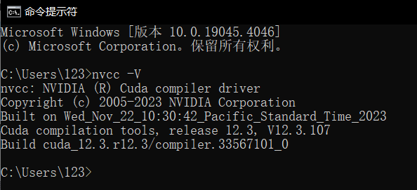

https://blog.csdn.net/weixin_64605288/article/details/125705684?utm_medium=distribute.pc_relevant.none-task-blog-2~default~baidujs_baidulandingword~default-0-125705684-blog-89462160.pc_relevant_multi_platform_whitelistv3&spm=1001.2101.3001.4242.1&utm_relevant_index=2

安装torch-2.1.0+cu121-cp310-cp310-win_amd64.whl

    import torch
    print(torch.cuda.device_count())
    print(torch.cuda.is_available())
    print(torch.backends.cudnn.is_available())
    print(torch.cuda_version)
    print(torch.backends.cudnn.version())
    结果：
    D:\git_cangku\gpu_test\venv\Scripts\python.exe D:\git_cangku\gpu_test\gpu_test.py 
    D:\git_cangku\gpu_test\venv\lib\site-packages\torch\nn\modules\transformer.py:20: UserWarning: Failed to initialize NumPy: No module named 'numpy' (Triggered internally at ..\torch\csrc\utils\tensor_numpy.cpp:84.)
    device: torch.device = torch.device(torch._C._get_default_device()),  # torch.device('cpu'),
    1
    True
    True
    12.1
    8801

    torch.cuda.device_count() 输出为 1，意味着您的系统有一个CUDA兼容的GPU设备。这对于运行需要大量并行计算的深度学习模型来说是好消息。

    torch.cuda.is_available() 返回 True，表明 PyTorch 能够识别并使用CUDA，这意味着您可以利用GPU加速您的计算任务。

    torch.backends.cudnn.is_available() 同样返回 True，表示您的系统安装并配置了cuDNN（CUDA Deep Neural Network library）。cuDNN是由NVIDIA提供的一个库，用于加速深度学习框架的计算，特别是那些涉及到深度神经网络的计算。

    torch.cuda_version 和 torch.backends.cudnn.version() 分别显示CUDA和cuDNN的版本号，这里是12.1和8801。这些信息对于确保您的开发环境与您所使用的深度学习库和模型兼容非常重要。

    在尝试导入和使用PyTorch时，出现一条警告信息：UserWarning: Failed to initialize NumPy: No module named 'numpy' (Triggered internally at ..\torch\csrc\utils\tensor_numpy.cpp:84.)
    这表明Python环境中没有安装NumPy库，或者当前的Python环境无法找到NumPy。

在训练模型环境里安装torch-2.1.0+cu121-cp310-cp310-win_amd64.whl

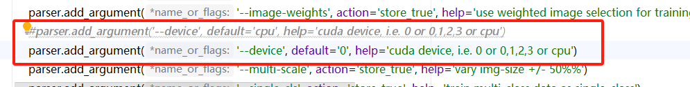

开始训练，报错

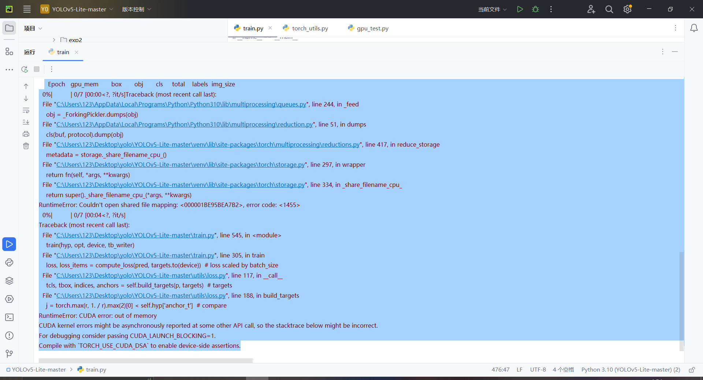

共享内存文件映射错误（Shared Memory File Mapping Error）：
这个错误通常与multiprocessing模块和共享内存有关。在Python中，当使用多进程进行数据加载时，通常会使用共享内存来传递数据。然而，出现了一个问题，导致共享内存文件映射失败。这可能是由于环境变量或操作系统限制引起的。

CUDA内存不足（CUDA Out of Memory Error）：
在进行训练时，CUDA内存耗尽。这通常发生在模型和/或数据太大，超出了GPU可用内存的情况下。这可能是因为模型太大，批次大小过大，图像尺寸过大等原因导致的。

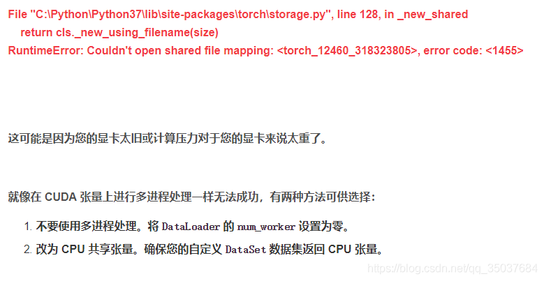

第二天起来，再次尝试训练一次，居然错误不一样了。

Logging results to runs\train\exp5
Starting training for 300 epochs...

        Epoch   gpu_mem       box       obj       cls     total    labels  img_size
        0/299   0.0986G    0.1211   0.02475   0.04159    0.1874        32       320: 100%|██████████| 7/7 [00:15<00:00,  2.15s/it]
                Class      Images      Labels           P           R      mAP@.5  mAP@.5:.95:   0%|          | 0/1 [00:01<?, ?it/s]
    Traceback (most recent call last):
    File "C:\Users\123\Desktop\yolo\YOLOv5-Lite-master\train.py", line 545, in <module>
        train(hyp, opt, device, tb_writer)
    File "C:\Users\123\Desktop\yolo\YOLOv5-Lite-master\train.py", line 355, in train
        results, maps, times = test.test(data_dict,
    File "C:\Users\123\Desktop\yolo\YOLOv5-Lite-master\test.py", line 121, in test
        out = non_max_suppression(out, conf_thres=conf_thres, iou_thres=iou_thres, labels=lb, multi_label=True)
    File "C:\Users\123\Desktop\yolo\YOLOv5-Lite-master\utils\general.py", line 497, in non_max_suppression
        i = torchvision.ops.nms(boxes, scores, iou_thres)  # NMS
    File "C:\Users\123\Desktop\yolo\YOLOv5-Lite-master\venv\lib\site-packages\torchvision\ops\boxes.py", line 41, in nms
        return torch.ops.torchvision.nms(boxes, scores, iou_threshold)
    File "C:\Users\123\Desktop\yolo\YOLOv5-Lite-master\venv\lib\site-packages\torch\_ops.py", line 692, in __call__
        return self._op(*args, **kwargs or {})
    NotImplementedError: Could not run 'torchvision::nms' with arguments from the 'CUDA' backend. This could be because the operator doesn't exist for this backend, or was omitted during the selective/custom build process (if using custom build). If you are a Facebook employee using PyTorch on mobile, please visit https://fburl.com/ptmfixes for possible resolutions. 'torchvision::nms' is only available for these backends: [CPU, QuantizedCPU, BackendSelect, Python, FuncTorchDynamicLayerBackMode, Functionalize, Named, Conjugate, Negative, ZeroTensor, ADInplaceOrView, AutogradOther, AutogradCPU, AutogradCUDA, AutogradXLA, AutogradMPS, AutogradXPU, AutogradHPU, AutogradLazy, AutogradMeta, Tracer, AutocastCPU, AutocastCUDA, FuncTorchBatched, FuncTorchVmapMode, Batched, VmapMode, FuncTorchGradWrapper, PythonTLSSnapshot, FuncTorchDynamicLayerFrontMode, PreDispatch, PythonDispatcher].

    CPU: registered at C:\actions-runner\_work\vision\vision\pytorch\vision\torchvision\csrc\ops\cpu\nms_kernel.cpp:112 [kernel]
    QuantizedCPU: registered at C:\actions-runner\_work\vision\vision\pytorch\vision\torchvision\csrc\ops\quantized\cpu\qnms_kernel.cpp:124 [kernel]
    BackendSelect: fallthrough registered at ..\aten\src\ATen\core\BackendSelectFallbackKernel.cpp:3 [backend fallback]
    Python: registered at ..\aten\src\ATen\core\PythonFallbackKernel.cpp:153 [backend fallback]
    FuncTorchDynamicLayerBackMode: registered at ..\aten\src\ATen\functorch\DynamicLayer.cpp:498 [backend fallback]
    Functionalize: registered at ..\aten\src\ATen\FunctionalizeFallbackKernel.cpp:290 [backend fallback]
    Named: registered at ..\aten\src\ATen\core\NamedRegistrations.cpp:7 [backend fallback]
    Conjugate: registered at ..\aten\src\ATen\ConjugateFallback.cpp:17 [backend fallback]
    Negative: registered at ..\aten\src\ATen\native\NegateFallback.cpp:19 [backend fallback]
    ZeroTensor: registered at ..\aten\src\ATen\ZeroTensorFallback.cpp:86 [backend fallback]
    ADInplaceOrView: fallthrough registered at ..\aten\src\ATen\core\VariableFallbackKernel.cpp:86 [backend fallback]
    AutogradOther: registered at ..\aten\src\ATen\core\VariableFallbackKernel.cpp:53 [backend fallback]
    AutogradCPU: registered at ..\aten\src\ATen\core\VariableFallbackKernel.cpp:57 [backend fallback]
    AutogradCUDA: registered at ..\aten\src\ATen\core\VariableFallbackKernel.cpp:65 [backend fallback]
    AutogradXLA: registered at ..\aten\src\ATen\core\VariableFallbackKernel.cpp:69 [backend fallback]
    AutogradMPS: registered at ..\aten\src\ATen\core\VariableFallbackKernel.cpp:77 [backend fallback]
    AutogradXPU: registered at ..\aten\src\ATen\core\VariableFallbackKernel.cpp:61 [backend fallback]
    AutogradHPU: registered at ..\aten\src\ATen\core\VariableFallbackKernel.cpp:90 [backend fallback]
    AutogradLazy: registered at ..\aten\src\ATen\core\VariableFallbackKernel.cpp:73 [backend fallback]
    AutogradMeta: registered at ..\aten\src\ATen\core\VariableFallbackKernel.cpp:81 [backend fallback]
    Tracer: registered at ..\torch\csrc\autograd\TraceTypeManual.cpp:296 [backend fallback]
    AutocastCPU: fallthrough registered at ..\aten\src\ATen\autocast_mode.cpp:382 [backend fallback]
    AutocastCUDA: fallthrough registered at ..\aten\src\ATen\autocast_mode.cpp:249 [backend fallback]
    FuncTorchBatched: registered at ..\aten\src\ATen\functorch\LegacyBatchingRegistrations.cpp:710 [backend fallback]
    FuncTorchVmapMode: fallthrough registered at ..\aten\src\ATen\functorch\VmapModeRegistrations.cpp:28 [backend fallback]
    Batched: registered at ..\aten\src\ATen\LegacyBatchingRegistrations.cpp:1075 [backend fallback]
    VmapMode: fallthrough registered at ..\aten\src\ATen\VmapModeRegistrations.cpp:33 [backend fallback]
    FuncTorchGradWrapper: registered at ..\aten\src\ATen\functorch\TensorWrapper.cpp:203 [backend fallback]
    PythonTLSSnapshot: registered at ..\aten\src\ATen\core\PythonFallbackKernel.cpp:161 [backend fallback]
    FuncTorchDynamicLayerFrontMode: registered at ..\aten\src\ATen\functorch\DynamicLayer.cpp:494 [backend fallback]
    PreDispatch: registered at ..\aten\src\ATen\core\PythonFallbackKernel.cpp:165 [backend fallback]
    PythonDispatcher: registered at ..\aten\src\ATen\core\PythonFallbackKernel.cpp:157 [backend fallback]

NotImplementedError: Could not run 'torchvision::nms' with arguments from the 'CUDA' backend. This could be because the operator doesn't exist for this backend, or was omitted during the selective/custom build process (if using custom build). If you are a Facebook employee using PyTorch on mobile, please visit https://fburl.com/ptmfixes for possible resolutions. 'torchvision::nms' is only available for these backends: [CPU, QuantizedCPU, BackendSelect, Python, FuncTorchDynamicLayerBackMode, Functionalize, Named, Conjugate, Negative, ZeroTensor, ADInplaceOrView, AutogradOther, AutogradCPU, AutogradCUDA, AutogradXLA, AutogradMPS, AutogradXPU, AutogradHPU, AutogradLazy, AutogradMeta, Tracer, AutocastCPU, AutocastCUDA, FuncTorchBatched, FuncTorchVmapMode, Batched, VmapMode, FuncTorchGradWrapper, PythonTLSSnapshot, FuncTorchDynamicLayerFrontMode, PreDispatch, PythonDispatcher].


NotImplementedError：无法使用来自“CUDA”后端的参数运行“torchvision：：nms”。这可能是因为此后端不存在运算符，或者在选择性/自定义生成过程中被省略（如果使用自定义生成）。如果您是在移动设备上使用 PyTorch 的 Facebook 员工，请访问 https://fburl.com/ptmfixes 了解可能的解决方案。'torchvision：：nms' 仅适用于以下后端： [CPU、QuantizedCPU、BackendSelect、Python、FuncTorchDynamicLayerBackMode、Functionalize、Named、Conjugate、Negative、ZeroTensor、ADInplaceOrView、AutogradOther、AutogradCPU、AutogradCUDA、AutogradXLA、AutogradMPS、AutogradXPU、AutogradHPU、AutogradLazy、AutogradMeta、Tracer、AutocastCPU、AutocastCUDA、FuncTorchBatched、FuncTorchVmapMode、Batched、VmapMode、FuncTorchGradWrapper、PythonTLSSnapshot、FuncTorchDynamicLayerFrontMode、PreDispatch, PythonDispatcher].

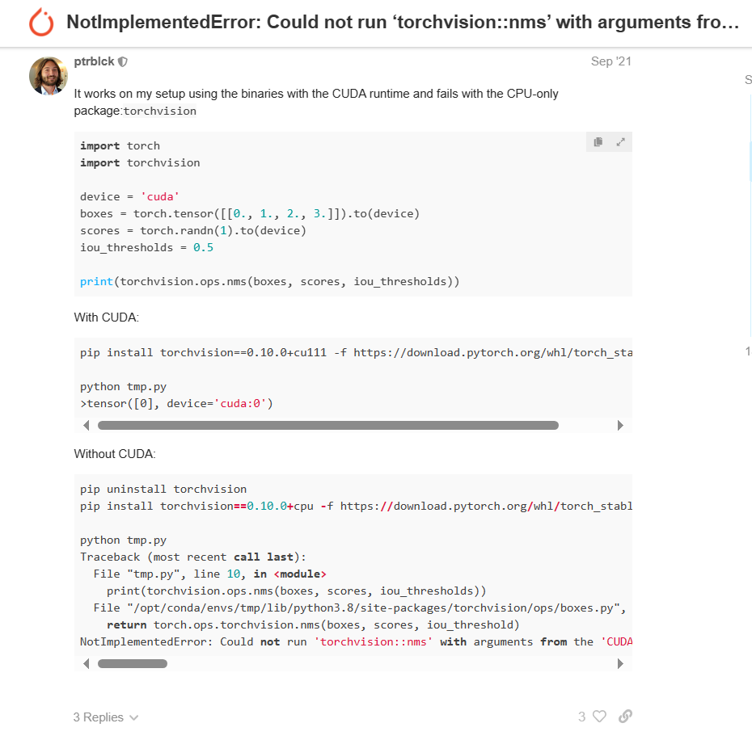

看不上很懂，对给gpt解释一下：

    这个问题说明在你的设置中，当使用支持CUDA的torchvision版本时，torchvision.ops.nms能够在GPU上正确执行。然而，当你卸载带CUDA支持的torchvision并安装了仅支持CPU的版本后，尽管你的代码尝试在CUDA设备上执行相同的操作，你遇到了NotImplementedError错误。
    这里的关键在于torchvision包和CUDA支持的关系。torchvision有不同的构建版本，一些版本包括了对CUDA的支持，而另一些则仅支持CPU。当你尝试在一个仅支持CPU的torchvision版本上执行一个需要CUDA支持的操作时（比如在GPU上执行nms），你会遇到错误，因为该操作尝试在一个不支持的后端（在这种情况下是CUDA）上执行。
    解释错误消息
    错误消息是说torchvision::nms操作无法在'CUDA'后端上运行，因为这个操作对于'CUDA'后端来说不存在或在自定义/选择性构建过程中被省略了。消息还提到了'torchvision::nms'只对这些后端可用：[CPU, QuantizedCPU, BackendSelect, Named, ADInplaceOrView, AutogradOther, AutogradCPU, AutogradCUDA, AutogradXLA, UNKNOWN_TENSOR_TYPE_ID, AutogradMLC, Tracer, Autocast, Batched, VmapMode]。这个列表显示了哪些后端支持nms操作，但如果你安装的是CPU-only版本的torchvision，尽管列表中提到了AutogradCUDA，实际上在尝试执行GPU相关操作时，你仍然会遇到问题。
    解决方案
    如果你需要在GPU上执行操作（如nms），确保安装了支持CUDA的torchvision版本。你可以根据你的CUDA版本来安装合适的torchvision和torch包。从你提供的命令来看，你已经知道如何为特定的CUDA版本安装正确的torchvision：

我安装了GPU版本的torch，但没有安装gpu版本的torchvision

https://github.com/ultralytics/ultralytics/issues/5059 这里也说了应该是torchvision的问题，社区氛围真的友善，且规范，问个问题都要有最小可复现的模型，瞻仰大佬

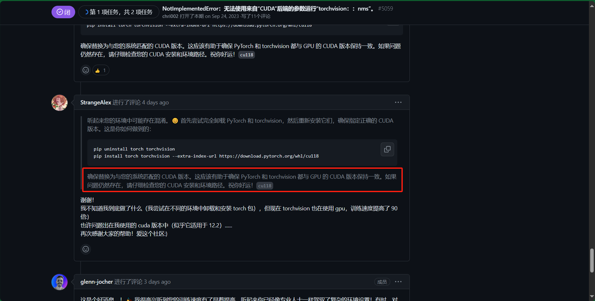

根据https://blog.csdn.net/shiwanghualuo/article/details/122860521

得出：torch：2.1	torchvision：0.16	python：>=3.8, <=3.11

下载torchvision-0.16.0+cu121-cp310-cp310-win_amd64.whl，似乎也可以用命令：pip install torchvision==0.16.0+cu121 -f https://download.pytorch.org/whl/torch_stable.html

每一步都踏在将要放弃的路上，这个总是让我感觉弄不出来，每次尝试都像是在向老天祷告一般。不过还是成功了，训练速度快了n倍，大概只需要10分钟左右，先前都需要个把小时的。这种感觉，爽

训练出来的模型可以用，不过还是那么不准确，书和收集傻傻分不清，可能是数据集里面的这两个东西有一半的部分被手遮挡了的缘故。

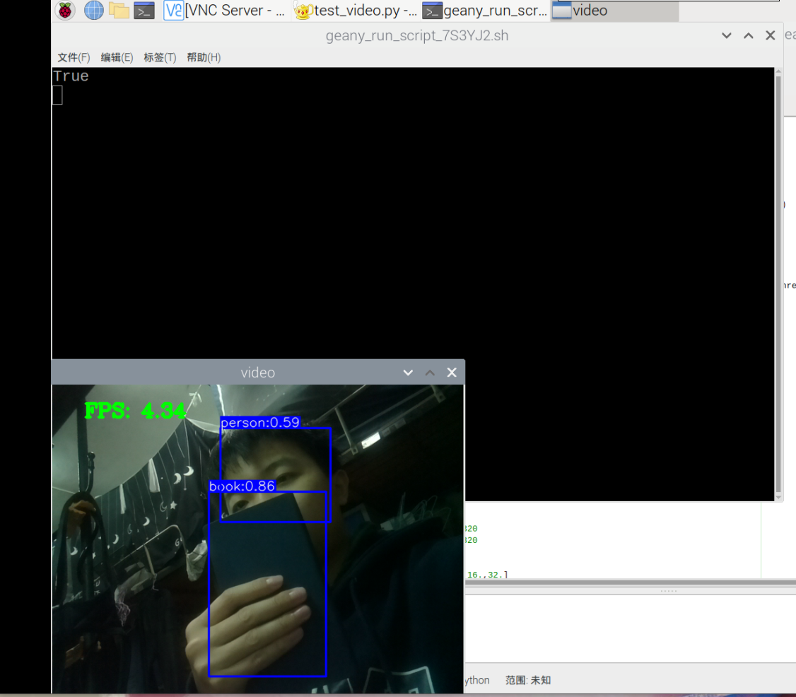

总结：
1.gpu只能帮助分析，特别是gpt3.5，用的都是过时的资料库，或许可以下载些插件什么的，查一些偏的深的bug还得是社区谷歌才行。
2.工科或许都是这样了，每天都会遇到bug，有时甚至想要放弃，换个方法，但还是得边分析，边搜索，必要时求助他人。何以平衡坚持还是放弃、换个方法。坚持不一定能成功，但放弃换个方法也不一定顺畅，总之要有一定的深度后，要有一定的思考和搜索深度后，还是不行，就可以考虑一下求助他人，或是换个方法。浅浅的思考频繁的换方法不可取

## 实验过程3
接下来的目标就是训练更好更精确的模型了

方法：
1.数据质量和数据增强：收集更多更好数据、数据增强
2.精细调整训练过程：学习率调整、简化问题
3.模型评估与迭代：持续迭代、测试和反馈

步骤一：先选择更合适的数据集，然后训练大一点的模型，然后部署
步骤二：选择更多更合适的数据集，尝试学习在谷歌在线训练更大的模型，然后把它部署。
步骤三：学习精细调整训练过程、学习模型评估与迭代

每当我感受到有压力，没信心做好的时候，总是会拖拖拉拉，无效工作麻痹自我，甚至会逃避，这时候更要做，更要劳动，这很重要。

如何收集和选择合适数据集
https://zhuanlan.zhihu.com/p/55364815

1. Kaggle数据集

一脸懵，了解一下分类

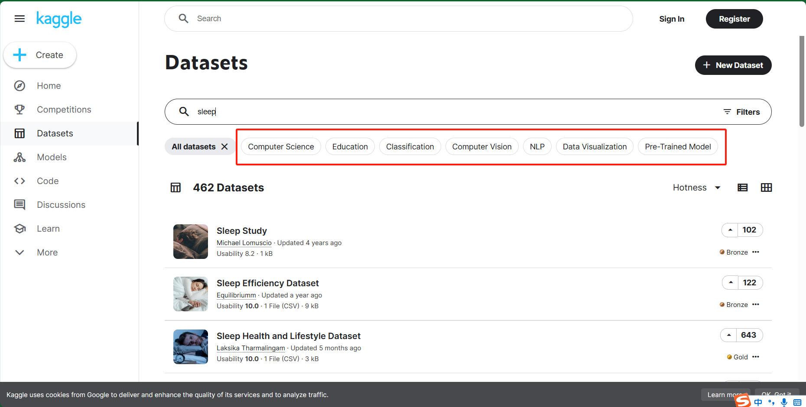

    当你在 Kaggle 上浏览数据集时，这些分类代表不同类型的数据集。让我为你解释一下每个类别的含义，并帮助你选择适合目标检测的数据集：

    1.Computer Science:
    这个分类包含与计算机科学相关的数据集。这可能涵盖了各种主题，例如算法、编程、网络、数据库等。
    如果你对计算机科学领域的目标检测感兴趣，你可以查找与计算机视觉相关的数据集。
    2.Education:
    这里的数据集与教育领域有关。它们可能包括学生表现、教育资源、学校评估等方面的数据。
    对于目标检测，这些数据集可能不太适合你的需求。
    3.Classification:
    分类数据集用于将数据分成不同类别。每个样本都有一个预定义的标签。
    如果你想要训练一个目标检测模型，你可能需要更详细的标注，例如边界框。
    4.Computer Vision:
    这个分类包含与计算机视觉相关的数据集。这些数据集通常包含图像和标注，适合目标检测任务。
    你可以在这里寻找人在床上状态的图像数据集。
    5.NLP (Natural Language Processing):
    NLP 数据集与自然语言处理相关。这些数据集包含文本、语言模型、情感分析等。
    对于目标检测，这些数据集不太适合。
    6.Data Visualization:
    这里的数据集通常用于创建图表、图形和可视化。它们不适合目标检测。
    7.Pre-Trained Model:
    这个分类通常不是数据集，而是预训练的模型权重。你可以使用这些权重来初始化你的目标检测模型。
    基于你的需求，我建议你在 Kaggle 中搜索与“人在床上状态”、“睡眠”、“玩手机”和“看书”相关的数据集。你可以在计算机视觉分类中查找适合的数据集，然后开始训练你的目标检测模型。

Computer Vision、Computer Science

IEEE VIP CUP 2021 数据集：https://www.kaggle.com/datasets/awsaf49/ieee-vip-cup-2021-train-val-dataset
这是挑战赛的数据集，大致是关于睡姿检测的，仰卧、左卧和右卧等 3 个一般类别中做出 15 个姿势。不太适合

我感觉找到合适的数据集可能比较困难，特别是合适的，特别在自己的需求还不是很明确的时候。

需求：状态检测（判断睡眠、玩手机、看书）
分析：
我需要的是一个摄像头，对准了床头。
首先是识别是否处于睡眠状态，其指标有两个，是否开着灯，若没有开灯，则默认睡眠，开着灯的话，若是人脸上的眼睛处于闭合状态，并且还躺着什么都不干很久，则处于睡眠状态。
接着是判断是否在玩手机、是否在看书。其指标是什么，不在于是躺着还是坐着，关键在于手上的东西是什么，是书本，还是手机，通过识别手中书本，手机来初略判断。

但有一些问题，人在睡眠时，开着灯，正面躺着，很容易识别出来，但侧躺着，就不容易，侧躺着玩手机，可能也会玩着玩着就睡着了，然后手机就搁在手边，手机甚至都不会息屏。

这就是平衡难度和舒适度的问题了。从一个健康的角度来看，判断睡眠状态，就只需要识别有没有灯源，全黑环境肯定是睡眠，若是全黑环境里手机在发光，则这个状态不对，直接播报，也有可能会误伤。若是完全没有关灯，那更要播报了。。。。

关键在于不播报的条件是什么，是睡着了，还是以健康的方式睡着了。
后者只需要识别环境是否是完全黑暗的条件。
前者的话，开不开的，有没有手机，有没有书本，侧躺着，正躺着，都可能会睡着。对于玩着玩着睡着的情况，如何判断是睡着了，还是还在玩手机。

或许单靠目标检测很难识别是否处于睡眠状态。

    或许可以这样，到点，摄像头检测
    环境全黑——》睡着
    环境全黑仍有光源——》提醒容易得青光眼
    环境开灯——》识别——》看书学习（播报）
                ——》玩手机（播报）

我能不能找到合适的数据集。就只关于看书学习和玩手机。
如何寻找这数据集的关键词。在床上，看书，玩手机。
在床上这个环境是必要的吗？
可能是不必要的，在其他环境的话，像是在沙发上，在椅子上，都是坐着，判断看书还是手机，这样的数据集可能找得到。这些环境的人都是坐着的。
而在床上的话，还有一种可能是躺着，侧躺着看书。

所以，不但要找到坐着看书的数据集，还要找一些躺着看书玩手机的数据集。两者结合在一起，构成床上这个环境。

接下来做的，首先是要找到看书，和玩手机这类似的数据集，完成坐着的情况识别的模型。测试一下这个模型在床上使用的效果，是不是能够将坐着时玩手机和看书识别出来。
然后增加一些躺着的玩手机和看书的数据集。训练出模型，测试一下能不能识别坐着和躺着的状态。

步骤一：完成坐着的识别模型（识别黑暗、光源不足————》识别坐着时看书、玩手机）
步骤二：增加躺着的数据集，训练模型。（识别黑暗、光源不足————》识别坐着、躺着时看书、玩手机）

逻辑：
黑暗环境、有一点光源的环境和明亮环境，若是在明亮环境，则进一步识别在看书还是在玩手机
这是两层的识别，需要的是一个模型还是两个模型。若是一个模型，那数据集又是长什么样的。

得问一下老师才行。

结果：分成两步、甚至是三步。先识别环境信息、留下光明环境的标签，然后识别躺着坐着，然后分别识别玩手机，看书。

**先完成第一个识别：识别环境（黑暗、有一点光源、明亮）**

数据集准备

拍摄两百张环境的照片，并进行标注

黑暗环境：
在完全黑暗的情况下，你可以使用虚拟标注来表示这一状态。虚拟标注是指在没有实际目标的情况下，为图像添加一个标注框。
你可以在图像中随机选择一个区域，然后用标注工具（如LabelMe）创建一个虚拟的标注框，表示这是一个黑暗环境。

有一点光源的环境：
对于有一点光源的环境，你已经知道如何标注了。使用LabelMe或类似的工具，将光源所在的区域框起来，并添加相应的标签。

明亮环境：
在明亮环境下，你可以选择标注整个图像，因为没有需要特别关注的目标。
使用标注工具，将整个图像框起来，并添加“明亮环境”或类似的标签。

上网找了一会，很难找到相应的数据集。还是用树莓派拍照，100张黑暗、10张有一点光源、100张明亮条件

训练部署结果：
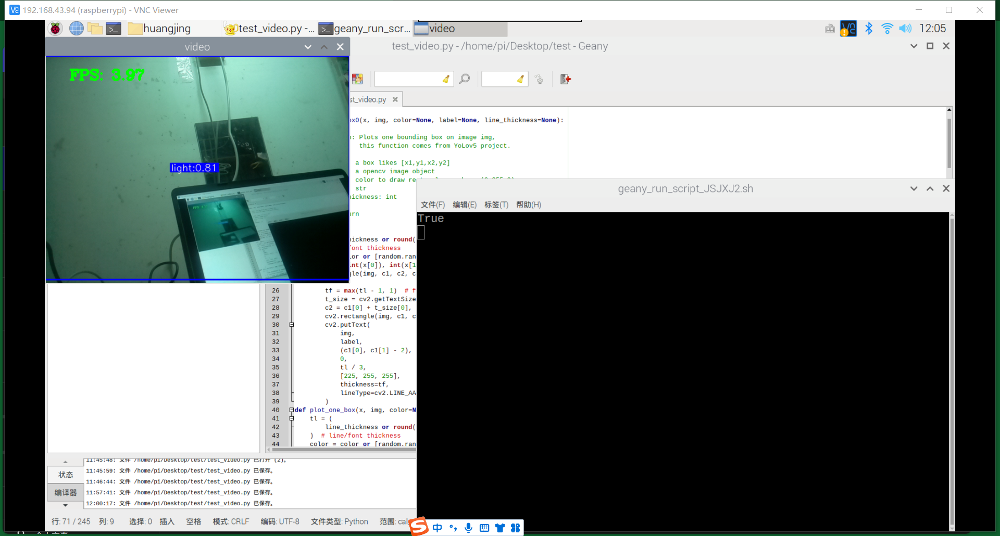

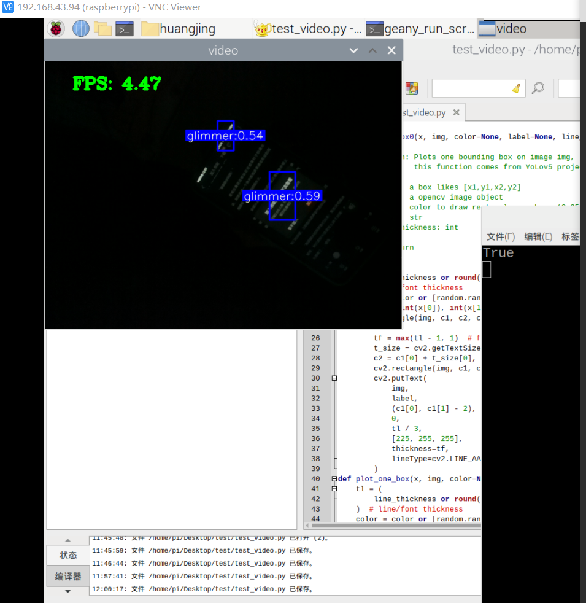

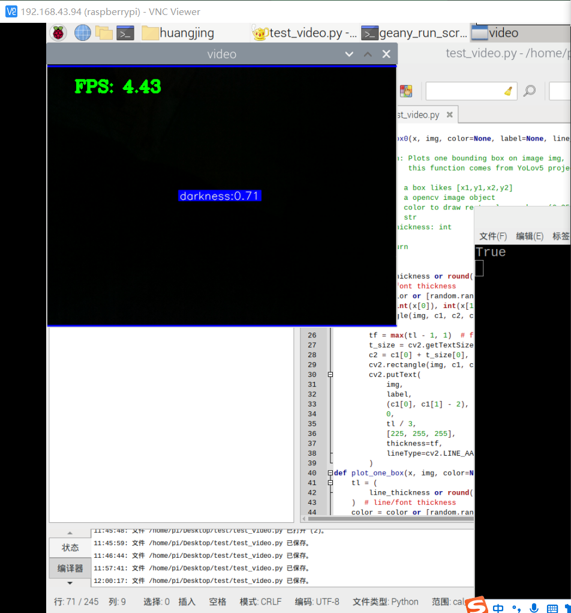

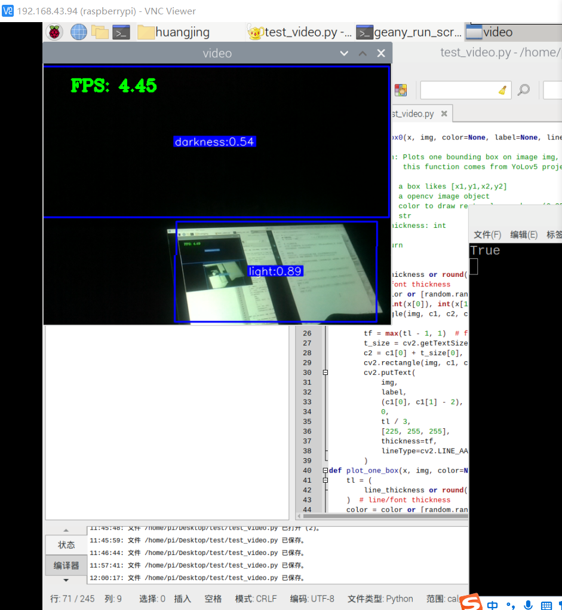

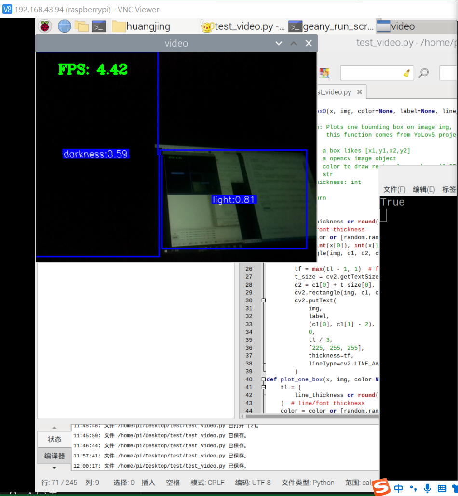

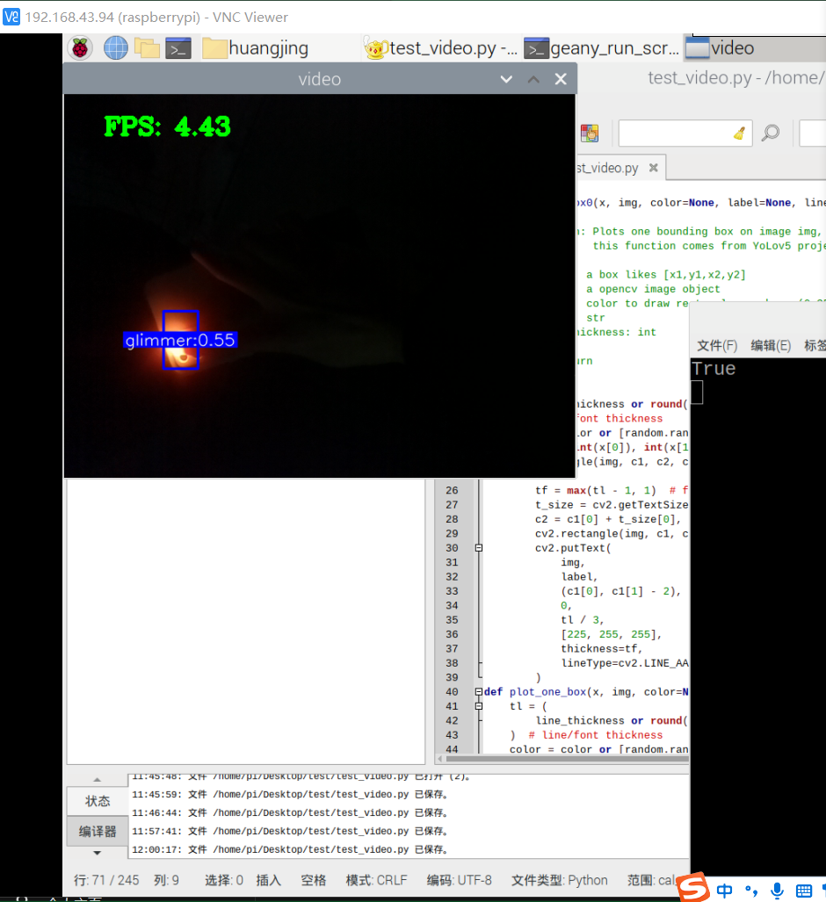

基本能用，对于有三者的情况基本能够识别，但准确率有待提高。而对于大片的光源，像是电脑，则难以分辨是明亮还是有一丝光亮。后续有待提高。

接下来就是在明亮状态下，识别玩手机和看书的状态，这两个状态可能会有很多个姿势，像是侧躺，正躺，坐着，可以在这三个姿势下识别玩手机和看书。

首先，先确认能否使用非树莓派拍摄的图片进行模型的训练，学会使用其他形式的照片训练模型，然后，对上面一个模型进行识别的成功率进行分析判断，若是可能性比较高，则尝试，不行就展开进行更深层度的学习。

收集20多张的图片，标注，拿去训练，发现难以收集jpg格式的图片，还是得学习爬取图片

## 实验过程4

学习爬取图片，制作数据集
训练模型

```py
import os
import requests

def download_image(url, save_path):
    try:
        response = requests.get(url)
        if response.status_code == 200:
            with open(save_path, 'wb') as f:
                f.write(response.content)
            print(f"Image saved at {save_path}")
        else:
            print(f"Failed to download image from {url}")
    except Exception as e:
        print(f"Error: {e}")

def main():
    image_url = "https://example.com/image.jpg"  # Replace with the actual image URL
    save_directory = "path/to/save/images"  # Replace with your desired local directory

    if not os.path.exists(save_directory):
        os.makedirs(save_directory)

    image_name = os.path.basename(image_url)
    save_path = os.path.join(save_directory, image_name)

    download_image(image_url, save_path)

if __name__ == "__main__":
    main()

```
大致原理的：批量获取jpg的url路径，然后用request获取数据直接下载，然后用os或是ultil保存。试了一会，发现同样效率不高，bing和baidu似乎都有反爬虫的防御，爬取的都是重复的东西。而且爬取，手动收集的图片良莠不齐，奇奇怪怪的还不如自己拍的。质量得不到保证
还是去csdn上买比较快。现在一个小时大约值20块，可以接收用5块钱换15分钟的交易。可以分开买看书和玩手机的数据集
csdn依旧是那么恶心，居然是付费资源，要90多，服

在https://aistudio.baidu.com/datasetdetail/105315/0下载play_phone的数据集

    如何使用谷歌英文搜索资料，
    为了获取关于读书状态的图像数据集，你可以使用一系列英文关键词进行搜索。由于你的目标是训练一个能够识别读书状态的YOLOv5模型，你需要找到包含各种读书场景的图像，比如在不同环境中阅读、使用不同姿势阅读等。以下是一些建议的搜索关键词：
    "Reading posture dataset"：搜索关于阅读姿势的数据集，这可能会包括坐着、躺着或站着阅读的图片。
    "Book reading dataset"：这个搜索可以提供更广泛的关于阅读书籍的场景图片，可能包括不同年龄和背景的人。
    "People reading dataset"：这个关键词组合更加泛化，能找到各种人阅读的场景，不局限于特定的姿势或环境。
    "Reading images dataset"：这是一个通用的搜索，旨在找到包含阅读活动的图片数据集。
    "Educational reading dataset" or "Academic reading dataset"：如果你想要的数据集更偏向于教育或学术场景，这些搜索词可能会更有帮助。

不应该啊，找不到。或许关键词不太对

又找了一个小时，看来是不能直接用关键词直接寻找到看书的数据集了，也可能是我不会用英文关键词。或许我应该学习一下外国人是怎么搜索资料的了。

开一个专题，边学习边记录

---
    我要做一个yolo模型，需要数据集，关于阅读的，识别人是否在看书学习。这个的数据集应该怎么搜索，给我5个中文关键词、5个英文关键词、5个日文关键词

    中文关键词：
    阅读行为数据集
    人在看书学习的图像数据
    阅读姿势识别数据集
    学习行为图像数据
    人在阅读时的目标检测数据集

    英文关键词：
    Reading behavior dataset
    Images of people reading and studying
    Reading posture recognition dataset
    Learning behavior images
    Object detection dataset for reading activities

    日文关键词：
    読書行動データセット
    人々が読書や勉強をしている画像
    読書のポーズ認識データセット
    学習行動の画像
    読書活動の物体検出データセット

google

intitle:"阅读*数据集" "目标检测"
https://blog.csdn.net/FL1623863129/article/details/136298888

阅读 OR 看书 OR 学习 目标检测 "数据集"（20700000条）
https://tianchi.aliyun.com/dataset/
学生课堂行为检测：SCB-dataset3
识别书：https://kylinhx.gitee.io/2023/03/12/ObjectDetectionDatasetsSurey/

---

目标检测和行为识别是两码事，或许都可以用一个模型实现，但太麻烦了，改为识别书籍：https://tianchi.aliyun.com/dataset/141479?t=1710578284771

现在有了phone和book的txt文件，连的id都为0，使用代码将book的id全部都改为1，然后class.txt；play_phone，book

```py
import os

# 指定目录路径
directory_path = r"D:\git_cangku\data\book\val"

# 获取目录中所有的.txt文件
txt_files = [f for f in os.listdir(directory_path) if f.endswith(".txt")]

# 遍历每个.txt文件并进行修改
for txt_file in txt_files:
    file_path = os.path.join(directory_path, txt_file)
    with open(file_path, "r") as f:
        content = f.read()
        # 将每行的第一个0替换为1
        modified_content = "\n".join(line.replace("0 ", "1 ", 1) for line in content.splitlines())

    # 将修改后的内容写回文件
    with open(file_path, "w") as f:
        f.write(modified_content)

print(f"All .txt files in {directory_path} have been updated.")

```
快7000张的数据集，10h以上。挺久的，希望一切顺利

跑了接近6个小时的时候，快一般的时候，看电脑时，发现pycham直接关闭了，没了。正好晚上，重新跑过，看看能不能成功。不能的话，就只能分析一下原因了，再不行用谷歌额度来跑。

跑了12个小时，部署好，发现效果不好。

结果：
1.图片检测，部分图片会出现满图片的框框，被全部覆盖，且置信度接近于0（可能是因为图片上有什么防伪的技术吧）
2.图片检测，书本很容易就检测出来（可能是因为书本的数据集不太好，没有经过挑选）
3.视频检测，玩手机这个行为很难检测出来（可能与玩手机的数据集不太好有关，所用的数据集都是行人拿着手机，然后大多都是打电话，很少玩手机）

解决：
1.用多样的标准的图片和视频测试，记录测试结果
2.在电脑上部署模型，再用上面的进行测试。
3.对数据集进行挑选
4.了解yolov5-lite模型训练一般用多少图片，如何规范的训练。

我觉得，应该是书本的数据集太差了，影响了手机的识别，先用1000张图片训练一下手机识别的模型，再然后用1000张训练书本识别的模型，分别测试一下两个模型。当两个都调试好后，再弄成一个模型。

训练好了玩手机的识别模型：结果如下

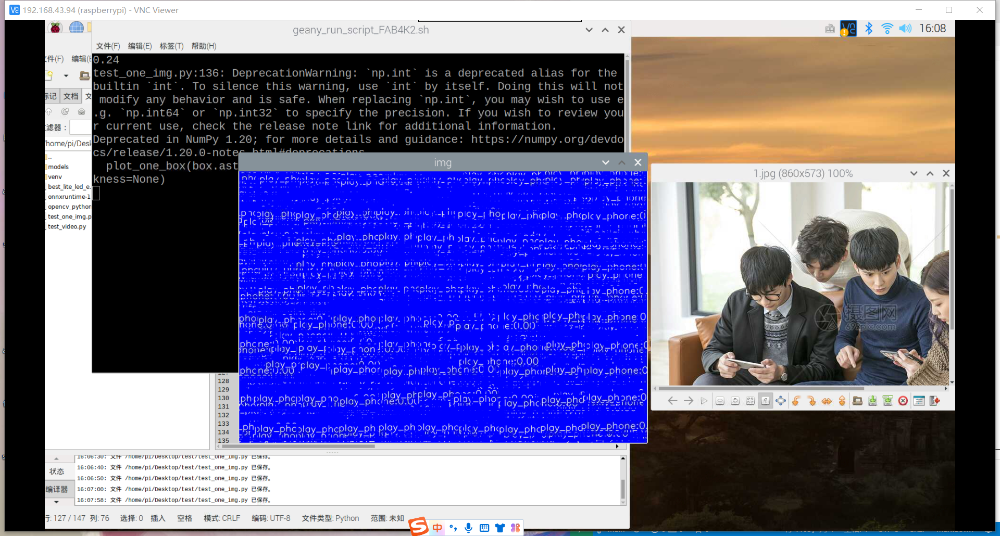

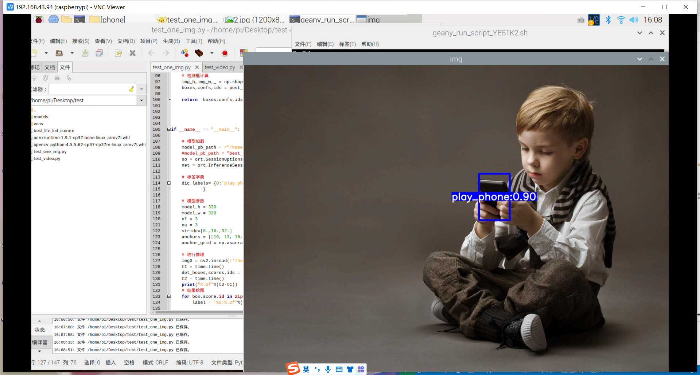
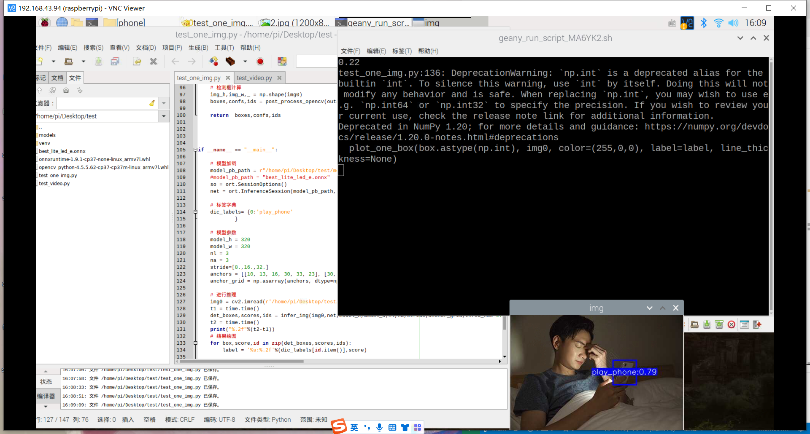
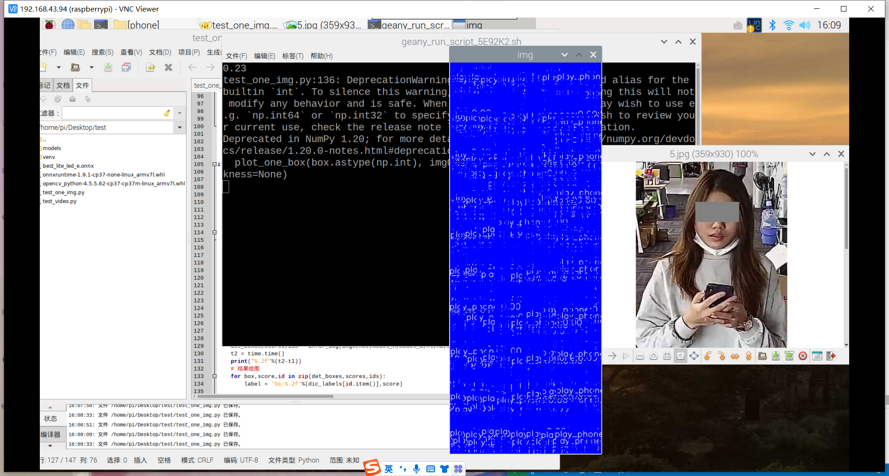
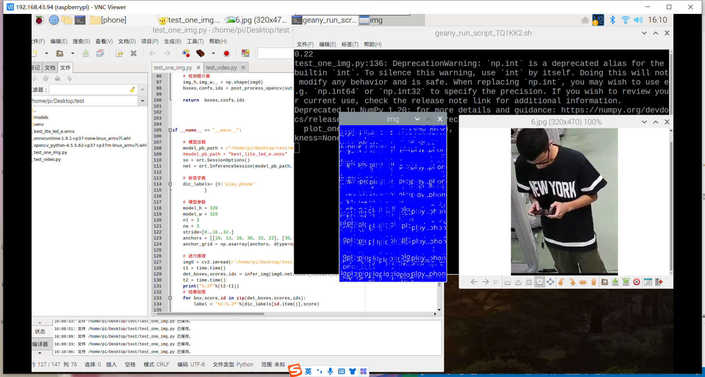
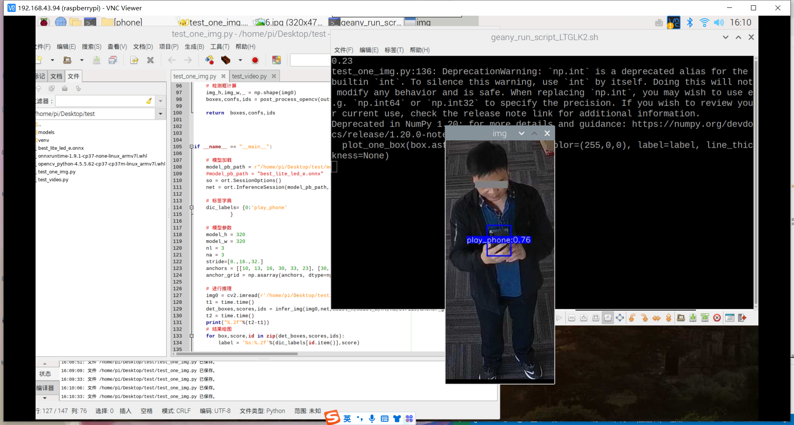
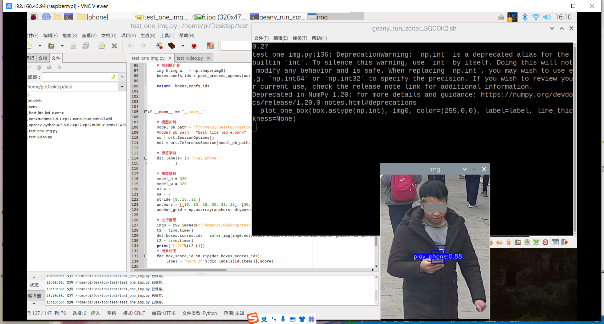
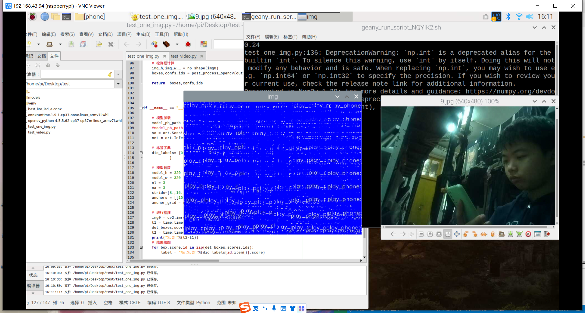
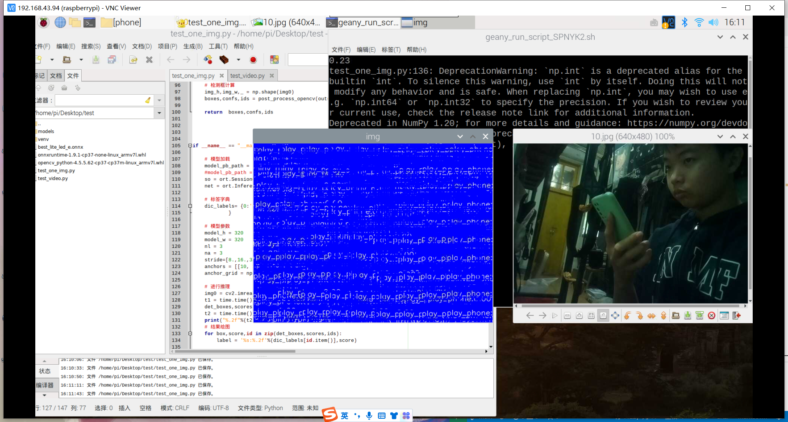
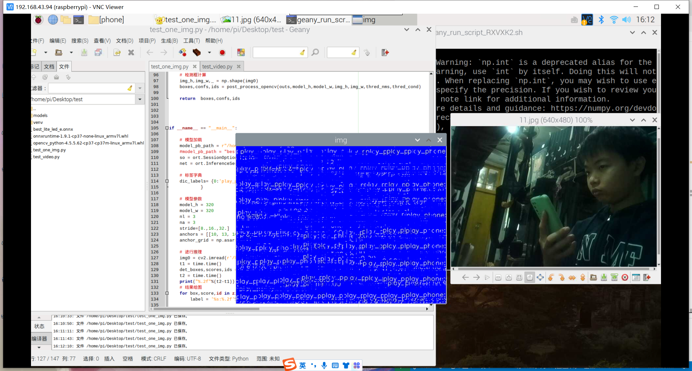


然后用之前老师范例教导训练的模型进行识别，试试失败的效果，结果发现也和上面识别失败的结果一样，就是图片被蓝色框框覆盖。

其实手机的识别还是可以的，但它的数据集不太合适，数据集是行人在路上玩手机（拿着手机、打电话偏多，而且手机还很小目标距离很远），也就是数据集不太丰富，过偏，导致某些情况下很明显在玩手机却没有识别出来，因此要丰富数据集。

想来书籍的识别也是如此，数据集太偏，不符合实际情况，导致一些很明显的情况却识别不出来。


原因：1.数据集不够丰富、2.树莓派摄像头不够清晰、手抖拍不清晰

先完成手机的识别，再然后书本，再然后结合。

1.买个支架和舵机，使之平稳，到后面可能控制舵机改变方向
2.提高摄像的清晰度，（换成usb摄像头/提高清晰度）
3.丰富数据集

其中，数据集最为重要，弄好后，在试一下模型能不能用，能不能在现实情况下识别出来。

当模型没问题后，再来搞摄像头的问题。

数据集关键词：床上玩手机、椅子上玩手机、地铁玩手机、教室玩手机、旅游玩手机、飞机玩手机、在饭店玩手机、吃饭时玩手机、酒吧玩手机
办公室玩手机、厕所玩手机、

